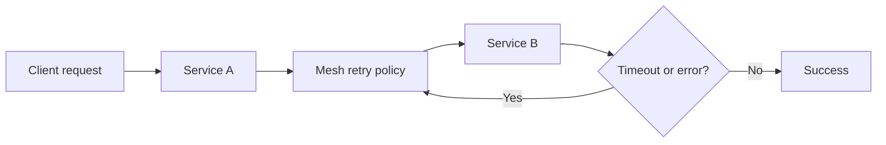

---
categories:
- Kubernetes
- Platform
- Backend
date: 2026-09-06
seo_title: 'Service mesh tradeoffs: retries, mTLS, and overhead - Advanced Guide'
seo_description: 'Advanced practical guide on service mesh tradeoffs: retries, mtls,
  and overhead with architecture decisions, trade-offs, and production patterns.'
tags:
- kubernetes
- platform-engineering
- reliability
- backend
- operations
title: 'Service mesh tradeoffs: retries, mTLS, and overhead'
toc: true
toc_icon: cog
toc_label: In This Article
header:
  overlay_image: "/assets/images/java-advanced-generic-banner.svg"
  overlay_filter: 0.35
  show_overlay_excerpt: false
  caption: Kubernetes Engineering for Backend Platforms
---
Service mesh debates often go wrong because teams bundle three different questions together:

- do we need stronger traffic policy controls?
- do we need uniform service-to-service security?
- do we want platform-managed observability at the network layer?

Retries, mTLS, and proxy overhead are not one decision.
They are a bundle of tradeoffs that often arrive together with a mesh.

## Quick Summary

| Concern | Mesh can help | Mesh can hurt |
| --- | --- | --- |
| retries and timeouts | central policy, safer defaults, visibility | retry storms, hidden amplification, debugging confusion |
| mTLS | uniform identity and encryption | certificate lifecycle complexity, handshake overhead |
| observability | per-hop metrics and traces | more moving parts and more places to misread latency |
| platform consistency | common policies across teams | one-size-fits-all defaults can be dangerous |

The right baseline is not "enable everything."
It is "enable the controls you can explain and operate."

## What a Mesh Actually Buys You

A service mesh usually adds sidecar or node-level data-plane logic that can enforce:

- retries
- timeouts
- circuit breaking
- mTLS
- traffic splitting
- per-hop telemetry

That is useful when application teams keep reimplementing inconsistent networking behavior.
It is less useful when the platform introduces policy complexity faster than teams can understand incidents.

## Start With the Failure You Want to Prevent

Examples:

- inconsistent retry policies across services
- missing service identity and encryption on east-west traffic
- no reliable way to canary traffic by version
- poor visibility into downstream hop latency

If those are not real pain points, a mesh may become an expensive abstraction with unclear return.

## Retry Policy Is the Most Common Source of Surprise

Retries sound safe because they improve transient success.
They are dangerous because they multiply traffic when the downstream is already struggling.

A single request path can become:

That loop is acceptable only when the retry budget is bounded and the downstream can survive it.

Good retry policy requires:

- explicit timeout budget
- idempotent or safe operation semantics
- small retry count
- backoff or jitter
- visibility into retry amplification

Without those, the mesh can convert one slow dependency into a cluster-wide saturation event.

## mTLS Is Usually Worth It, but Not Free

mTLS gives you:

- service identity
- encrypted east-west traffic
- stronger trust boundaries

That is a real improvement, especially in multi-tenant or regulated environments.

But it also adds:

- certificate issuance and rotation logic
- handshake and CPU cost
- more complicated failure diagnosis
- another source of "it works locally but not in-cluster"

The right question is not whether encryption is good.
It is whether the platform team can make identity, rotation, and debugging boring enough to trust.

## Overhead Is Not Only CPU

Teams often reduce mesh cost to sidecar CPU and memory.
That matters, but it is not the whole bill.

Operational overhead also includes:

- another hop in the request path
- more configuration layers
- more dashboards to interpret
- ambiguity about whether the bug lives in app, proxy, policy, or network

For low-latency paths, even modest per-hop overhead can become meaningful.
For most business services, the bigger cost is usually debugging complexity.

## When a Mesh Is a Strong Fit

Use one when several of these are true:

- many teams need common traffic and security policy
- service identity must be consistent across the platform
- canary or traffic splitting is operationally important
- per-hop telemetry is worth the runtime and debugging cost

Be more cautious when:

- the platform is small and the team can manage policies in app code or gateways
- the latency budget is very tight
- the organization does not yet have the operational maturity to run the control plane well

## Rollout Advice for Mesh Adoption

Do not roll out the full feature set everywhere at once.

A safer order is:

1. baseline observability
2. simple timeouts
3. limited retries
4. mTLS in a controlled scope
5. advanced routing or policy layering

This order makes it easier to isolate which feature introduced pain.

## Failure Modes to Watch

### Retry amplification

The mesh increases downstream pressure while dashboards initially show "better success."

### Timeout budget mismatch

Application timeouts and mesh timeouts disagree, creating double waits or premature aborts.

### mTLS certificate or identity drift

Traffic fails because identity assumptions broke, not because the application changed.

### Sidecar resource starvation

The proxy becomes the bottleneck and the app gets blamed.

### Policy hidden from application teams

Incidents slow down because the real behavior lives in mesh config nobody expected.

## First Drill to Run

Choose one internal service path and intentionally introduce a slow downstream.
Then verify:

1. retries remain bounded
2. timeouts fail where expected
3. telemetry shows where delay actually came from
4. the team can tell whether the problem is app code or proxy behavior

If the answer is unclear, the mesh is not observable enough yet.

## Production Checklist

- retry policy is bounded and operation-aware
- timeout budgets are aligned across app and mesh layers
- mTLS rollout has clear identity and rotation ownership
- proxy resource cost is measured on real traffic
- dashboards separate app latency from proxy latency
- policy changes are reviewable and explainable
- teams know where to debug when the network path misbehaves

## Key Takeaways

- A service mesh is valuable when traffic policy, identity, and observability are real shared platform problems.
- Retries are the easiest feature to misuse because they can amplify failure while looking helpful.
- mTLS is usually worth adopting, but only with disciplined identity and certificate operations.
- The biggest mesh cost is often debugging complexity, not just sidecar CPU.
