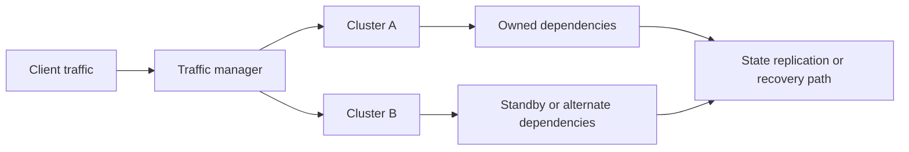

---
categories:
- Kubernetes
- Platform
- Backend
date: 2026-09-09
seo_title: Multi-cluster deployment and failover architecture - Advanced Guide
seo_description: Advanced practical guide on multi-cluster deployment and failover
  architecture with architecture decisions, trade-offs, and production patterns.
tags:
- kubernetes
- platform-engineering
- reliability
- backend
- operations
title: Multi-cluster deployment and failover architecture
toc: true
toc_icon: cog
toc_label: In This Article
header:
  overlay_image: "/assets/images/java-advanced-generic-banner.svg"
  overlay_filter: 0.35
  show_overlay_excerpt: false
  caption: Kubernetes Engineering for Backend Platforms
---
Multi-cluster is one of the easiest platform decisions to over-romanticize.
It sounds like automatic resilience, stronger isolation, and easy disaster recovery.
In practice, it often means more control planes, more drift, more routing complexity, and new failure modes that the team has never rehearsed.

That does not make multi-cluster a bad idea.
It makes it a design choice that only pays off when ownership and failover semantics are explicit.

## Quick Summary

| Model | Best fit | Strength | Main risk |
| --- | --- | --- | --- |
| Single cluster, multiple AZs | most teams | simplest operations | cluster-level blast radius still shared |
| Active-passive multi-cluster | disaster recovery, regional standby | clearer ownership and lower coordination cost | failover is slower and often under-tested |
| Active-active multi-cluster | global traffic, high resilience requirements | higher steady-state availability potential | data and failover semantics become much harder |
| Cell-based multi-cluster | tenant or shard isolation | strong blast-radius control | operational tooling must be mature |

Part 1 is about the baseline.
Before traffic managers and sync controllers multiply, decide what problem multi-cluster is actually solving.

## Good Reasons to Add Another Cluster

Strong reasons:

- regional or regulatory separation
- reducing blast radius for a large platform
- isolating workloads with very different operational profiles
- disaster recovery requirements that a single cluster cannot meet

Weak reasons:

- "everyone serious uses multi-cluster"
- avoiding one or two specific application problems
- copying a cloud vendor reference architecture without matching constraints

Another cluster is not just another deployment target.
It is another failure domain, another drift surface, and another place where assumptions can silently diverge.

## The First Decision: What Fails Over Together?

A cluster never fails over in isolation.
The real unit is a service plus its dependencies:

- databases
- message brokers
- DNS or traffic manager
- secrets and identity systems
- artifact delivery and config distribution

If only the stateless frontend can move but the write path still depends on a primary-region database, then the system does not truly fail over.
It reroutes part of the request path while keeping the hard dependency in place.

That is not always wrong.
It just needs to be named honestly.

## Baseline Multi-Cluster Shapes

### Active-passive

One cluster serves traffic.
Another is warm or cold standby.

Good fit:

- simpler ownership model
- clearer runbooks
- lower steady-state coordination

Tradeoff:
the standby path must be exercised deliberately or it will rot.

### Active-active

Both clusters serve production traffic.

Good fit:

- regional traffic distribution
- systems that already understand partitioned ownership

Tradeoff:
shared-state semantics become the real problem, not just Kubernetes deployment.

### Cell-based

Each cluster owns a subset of tenants, shards, or capabilities.

Good fit:

- blast-radius reduction
- scale through partitioning
- operational isolation for large platforms

Tradeoff:
routing, provisioning, and observability must all be cell-aware.

## A Safe Baseline Architecture

The most practical early model is often active-passive or cell-based, not full active-active.

The important thing is not the diagram.
It is whether the ownership rule is clear:

- which cluster is primary for this service right now?
- what state is replicated, and how fast?
- what dependency prevents full failover?
- who decides failback?

If those answers are fuzzy, the architecture is not ready regardless of tooling quality.

## The Most Common Multi-Cluster Illusions

### Illusion 1: Two clusters means no single point of failure

Not if both clusters depend on the same:

- control plane service
- secret backend
- certificate authority
- image registry
- database cluster
- global rate-limiter or auth service

Shared dependencies quietly reintroduce shared blast radius.

### Illusion 2: Traffic switching equals recovery

Traffic movement is only one part of failover.
If sessions, caches, queues, or writes are inconsistent after the move, the system may be reachable but still broken.

### Illusion 3: GitOps guarantees symmetry

GitOps reduces manual drift.
It does not eliminate differences in:

- capacity
- node pools
- quotas
- cloud-side dependencies
- hidden emergency changes

Operationally identical clusters are rare.
Runbooks should assume that.

## What to Measure Before Claiming Readiness

At minimum:

- traffic split by cluster
- failover trigger reason
- recovery time objective and actual failover time
- replication lag for stateful dependencies
- configuration drift detections
- dependency health by cluster

You also want to know whether the passive path is stale:

- outdated secrets
- missing images
- broken policy sync
- incompatible database migrations

Those failures usually appear during the first real incident, which is the most expensive time to discover them.

## Failure Drills That Matter

Do not only test "black-hole cluster A and route to cluster B."
That proves less than teams think.

Also test:

1. partial degradation where cluster A is slow, not dead
2. dependency outage in only one cluster
3. stale config or missing secret in the passive cluster
4. failback after the primary returns
5. one service failing over while another shared dependency does not

Real incidents are messy.
Your drills should be messy too.

## A Practical Decision Rule

Multi-cluster is justified when it gives a clear answer to at least one of these:

- what blast radius is now smaller?
- what regulatory boundary is now enforced?
- what recovery objective is now achievable?
- what scaling boundary is now cleaner?

If the answer is mainly "it feels more robust," the architecture may be adding surface area without delivering a measurable operational win.

## Part 1 Checklist

- the reason for multi-cluster is explicit and measurable
- the failover unit includes dependencies, not just pods
- ownership and primary/secondary semantics are documented
- passive or alternate paths are exercised regularly
- observability distinguishes traffic switch from true recovery
- failback is part of the design, not an afterthought

## Key Takeaways

- Multi-cluster is a blast-radius and recovery design, not a status symbol.
- The hardest part is usually state and dependency semantics, not Kubernetes manifests.
- A simpler active-passive or cell-based model often beats premature active-active complexity.
- If the team cannot explain what actually fails over together, the platform is not ready to promise resilience.
