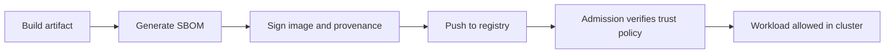

---
categories:
- Kubernetes
- Platform
- Backend
date: 2026-09-10
seo_title: 'Supply chain security: SBOM, signing, and admission policies - Advanced
  Guide'
seo_description: 'Advanced practical guide on supply chain security: sbom, signing,
  and admission policies with architecture decisions, trade-offs, and production patterns.'
tags:
- kubernetes
- platform-engineering
- reliability
- backend
- operations
title: 'Supply chain security: SBOM, signing, and admission policies'
toc: true
toc_icon: cog
toc_label: In This Article
header:
  overlay_image: "/assets/images/java-advanced-generic-banner.svg"
  overlay_filter: 0.35
  show_overlay_excerpt: false
  caption: Kubernetes Engineering for Backend Platforms
---
Supply chain security is where many platform teams discover that "we scan images" is not the same thing as "we trust what is running."

An SBOM can tell you what is inside an artifact.
A signature can tell you who claimed to produce it.
An admission policy can decide what the cluster is willing to run.
Those are related controls, but they solve different parts of the trust problem.

The practical goal is not to collect security nouns.
It is to make promotion trustable enough that operators know why an image was admitted, why it was blocked, and how exceptions are handled without panic-driven bypasses.

## Quick Summary

| Control | Best use | What it does not solve |
| --- | --- | --- |
| SBOM | inventory and dependency visibility | it does not prove artifact integrity |
| signing / provenance | prove artifact origin and build identity | it does not replace vulnerability triage |
| admission policy | enforce what can run in-cluster | it does not fix a weak upstream build pipeline |
| digest pinning | ensure immutable deployment identity | it does not prove the image is safe |
| exception workflow | keep enforcement usable under pressure | it does not excuse permanent bypasses |

The safest mindset is:
build trust before admission, then enforce trust at admission.

## What This Post Is Really About

The hardest part of supply chain policy is not enabling the tools.
It is establishing a promotion path that operators can explain during a real release.

That means answering:

- which identities are allowed to sign artifacts
- whether images must be deployed by digest
- what evidence admission requires
- how emergency exceptions are recorded and expired

Without that operational model, supply chain controls either become decorative or so painful that teams learn how to bypass them.

## A Better Baseline Trust Flow

That flow matters because each step has a different job.
Do not merge them mentally into one vague "security scan passed" checkbox.

## SBOM Is Inventory, Not Approval

An SBOM is valuable because it makes software contents visible:

- package inventory
- transitive dependencies
- version history
- vulnerability triage inputs

That visibility is useful for:

- incident response
- upgrade planning
- license review
- targeted patch campaigns

It is not itself an admission decision.
A clean SBOM does not prove the artifact came from the right pipeline, and a complete SBOM does not automatically mean the workload should run.

## Signing and Provenance Define Artifact Trust

Signing answers a different question:
who produced this artifact, and can we verify that claim?

That is what makes signatures and provenance statements powerful.
They let the platform distinguish between:

- an image built by the approved pipeline
- an image copied in from somewhere unknown
- a mutable tag pointing to a different artifact than expected

This is why digest pinning matters too.
A signature on a mutable tag is much weaker operationally than a signature tied to an immutable digest.

## Admission Policy Is the Cluster Boundary

Admission should enforce the minimum trust contract the cluster is willing to accept.

Typical examples:

- image must be referenced by digest
- image must be signed by an approved identity
- registry must be on the allowlist
- required attestations must exist for production namespaces

That boundary matters because it turns supply chain controls from best effort into actual deployment policy.

## Common Failure Modes

### Audit-only forever

Teams enable policy visibility but never turn on meaningful enforcement.
That teaches everyone the controls are optional.

### Signatures exist, but nobody verifies them

This is the supply-chain equivalent of storing backups you never test.

### Mutable tag workflows remain normal

If `:latest` or mutable release tags stay central, operators cannot reliably reason about what is running.

### No exception path

A security control without a temporary, auditable exception flow often gets bypassed out of frustration.

### Exception path becomes permanent policy

The opposite failure is turning "temporary waiver" into the real default.

## A Practical Rollout Strategy

Do not jump straight to hard enforcement across every namespace.
Start with:

1. inventory and observe
2. publish violations in audit mode
3. fix the obvious pipeline and registry issues
4. enforce in one controlled environment
5. promote to production namespaces with an explicit exception process

That sequence keeps the policy credible.
It also prevents an avoidable first impression where "security policy" means "deployment outage."

## What Operators Need During a Blocked Deployment

When admission rejects a workload, the platform should make it obvious:

- which policy failed
- which artifact identity was expected
- whether the issue is signing, provenance, registry, or digest
- how to request a temporary exception

If the operator experience is just "denied by policy," the system will earn resentment instead of trust.

## Metrics Worth Tracking

At minimum, expose:

- admission denials by reason
- unsigned image attempts
- mutable-tag deployment attempts
- exception grants and expirations
- SBOM generation coverage
- signature verification failures by environment

Those metrics tell you whether the platform is actually shifting behavior or merely producing paperwork.

## A Practical Governance Rule

Treat supply chain security as release policy, not just security tooling.
That means:

- approved signer identities are owned explicitly
- admission requirements differ by environment intentionally
- exceptions are time-bounded and reviewed
- deployment tooling prefers immutable digests by default

That is how supply chain controls become something operators can live with instead of something they work around.

## Key Takeaways

- SBOM, signing, and admission policy solve different trust problems and should stay conceptually separate.
- The cluster boundary should verify trust, not merely hope upstream controls were followed.
- Digest pinning and signature verification are operationally more important than many teams realize.
- A usable exception process is part of good enforcement, not a weakness in it.
