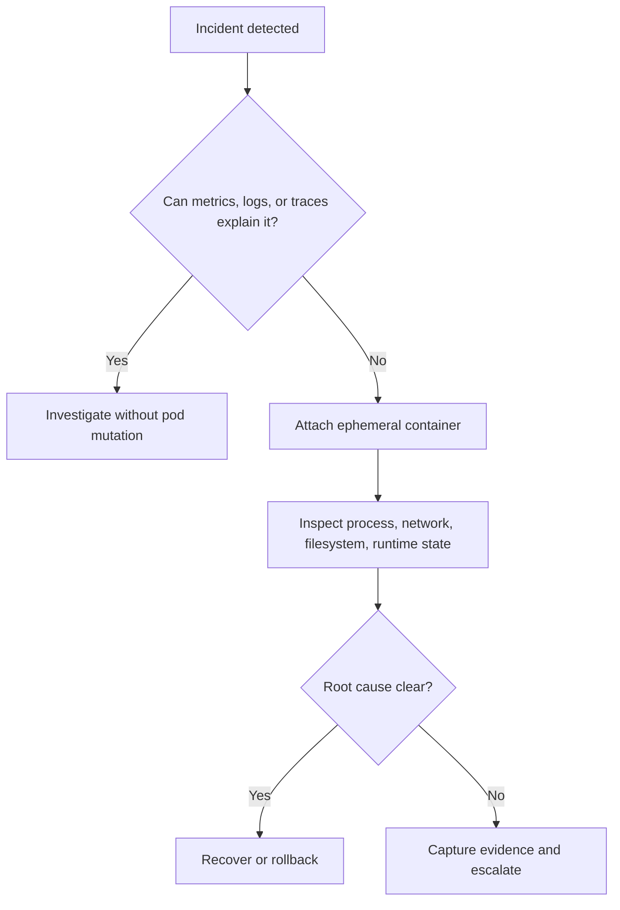

---
categories:
- Kubernetes
- Platform
- Backend
date: 2026-09-11
seo_title: Production debugging with ephemeral containers and tracing - Advanced Guide
seo_description: Advanced practical guide on production debugging with ephemeral containers
  and tracing with architecture decisions, trade-offs, and production patterns.
tags:
- kubernetes
- platform-engineering
- reliability
- backend
- operations
title: Production debugging with ephemeral containers and tracing
toc: true
toc_icon: cog
toc_label: In This Article
header:
  overlay_image: "/assets/images/java-advanced-generic-banner.svg"
  overlay_filter: 0.35
  show_overlay_excerpt: false
  caption: Kubernetes Engineering for Backend Platforms
---
Ephemeral containers are one of the best examples of Kubernetes solving a real operator problem:
you need to inspect a live pod without rebuilding the application image just to add debugging tools.

That does not make them a free pass for production forensics.
They help only when teams are clear about what they are trying to observe, how they preserve safety, and when they should stop debugging and shift to recovery.

## Quick Summary

| Question | Good use | Bad use |
| --- | --- | --- |
| Need tools not present in the app image? | strong fit | rebuilding prod images for emergency shells |
| Need to inspect network, process, or filesystem state in a live pod? | strong fit | changing application behavior in place |
| Need repeatable long-term diagnostics? | mixed | one-off manual debugging should not replace observability |
| Need production-safe forensic access? | possible with guardrails | dangerous without RBAC and audit controls |

## What Ephemeral Containers Actually Solve

They solve a specific problem:
the application container is intentionally slim and production-safe, but now you need tools such as:

- `ss`
- `tcpdump`
- `strace`
- shell utilities
- language-specific inspection tools

without restarting the pod or shipping those tools in the main runtime image.

That is operationally useful because production incidents rarely wait for a new image build.

## What They Do Not Solve

Ephemeral containers do not fix weak observability.
They do not replace:

- logs with request correlation
- metrics with version or pod labels
- tracing
- profiling
- sane application health endpoints

If the team reaches for ephemeral containers on every incident, the real problem is often missing baseline instrumentation.

## A Safe Debugging Workflow

The goal is not to stay inside the ephemeral container.
The goal is to shorten time to understanding without making the incident harder to manage.

## Good Production Use Cases

### Network path debugging

Examples:

- DNS resolution differs from expectation
- TLS handshake failures are inconsistent
- one downstream path is timing out only in-cluster

### Process inspection

Examples:

- too many open file descriptors
- unexpected child processes
- thread or socket buildup

### Filesystem or mount inspection

Examples:

- projected secrets are stale
- volume contents differ between pods
- generated config is not what the application expects

These are exactly the cases where "I need one more image build" is too slow.

## Why Tracing Still Matters More

Ephemeral containers help you inspect one pod at one moment.
Tracing helps you understand a request path across services and retries.

That is why the best debugging model is layered:

1. logs, metrics, traces for system-wide signal
2. ephemeral container only when localized inspection is needed

If you reverse that order, incident response becomes slower and less repeatable.

## Guardrails You Need in Production

### Strong RBAC

Not every engineer should be able to attach arbitrary debug containers to production pods.

### Auditability

The organization should know:

- who attached the container
- when
- to which workload
- for what purpose

### Read-only mindset

Use ephemeral containers to inspect first.
Once they start modifying filesystem state or running risky tools casually, the incident boundary becomes harder to reason about.

### Tooling hygiene

Have a standard debug image with approved tools instead of improvising during an outage.

## Common Failure Modes

### Debugging the symptom, not the path

A pod may look slow only because the real problem is upstream retry pressure or downstream saturation.

### Treating shell access as observability

If incidents require shelling into a pod every time, platform visibility is underdeveloped.

### Attaching to the wrong pod

Under autoscaling or rolling deploys, the suspicious pod may not be the one currently serving the failing traffic.

### Forgetting blast radius

Running heavy diagnostic tools on a hot production pod can make the incident worse.

## A Practical Example

Suppose requests are timing out only in one zone.
Metrics show elevated downstream latency, but not why.
An ephemeral container can help verify:

- DNS behavior inside the pod
- active socket state
- TLS negotiation reachability
- whether the app container sees the expected mounted config

That is much more targeted than rebuilding the runtime image with debugging tools baked in.

## First Drill to Run

Run a controlled exercise where:

1. one service has an injected DNS or downstream connectivity issue
2. the on-call engineer must use existing dashboards first
3. an ephemeral container is attached only if those signals are insufficient
4. the team records what was learned that should become permanent observability

That last step matters most.
Good incident tooling should teach the platform what to instrument better next time.

## Production Checklist

- RBAC for ephemeral container access is explicit
- attach events are auditable
- approved debug images exist ahead of incidents
- engineers know when to use traces first and shell access second
- debug actions avoid mutating production state casually
- findings from incidents feed back into permanent instrumentation

## Key Takeaways

- Ephemeral containers are a precise debugging tool, not a substitute for observability.
- They are strongest for inspecting live network, process, and filesystem state without rebuilding images.
- Production safety depends on RBAC, auditability, and disciplined usage.
- The best incident outcome is not "we got a shell"; it is "we learned enough to reduce future shell dependence."
