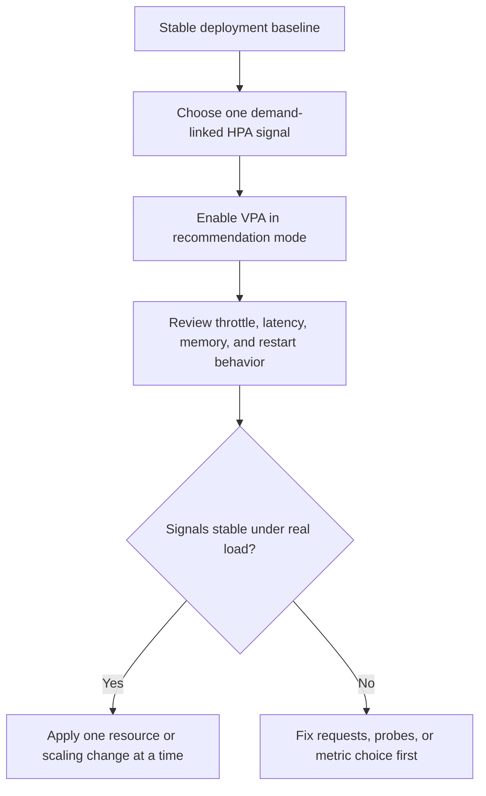

Part 2 is where autoscaling stops looking like a metric problem and starts looking like a control-systems problem.

Part 1 usually covers what HPA and VPA do.
The next level is understanding why perfectly valid settings still behave badly together once traffic shifts, probe timing, CPU throttling, JVM memory behavior, and rollout churn all start interacting.

## Quick Summary

| Decision area | Safer default | Why |
| --- | --- | --- |
| HPA signal choice | scale on demand-correlated metrics | visible metrics are not always useful metrics |
| VPA posture | start in recommendation mode | it is easier to learn workload shape than to undo controller churn |
| CPU-based HPA | keep requests realistic | bad requests create distorted utilization signals |
| Memory-sensitive services | use extra caution | memory pressure is slower, stickier, and often more destructive |
| Policy changes | change one lever at a time | otherwise operators cannot explain the outcome |

The central question is simple:
are you scaling on real demand, or on artifacts created by your own configuration?

## What Part 2 Is Really About

Autoscaling issues usually come from one of these mismatches:

- the metric does not represent real work
- the workload requests make the metric misleading
- the application startup or warmup time makes scaling late
- HPA and VPA are both reacting to the same instability in different ways

None of those problems are visible in a happy-path demo.
All of them show up quickly under real pressure.

## HPA Needs a Demand Signal, Not Just a Visible Signal

CPU is easy to graph.
That does not make it the best scaling trigger.

For many backends, demand is better represented by:

- inflight requests
- queue depth
- concurrency saturation
- request latency combined with utilization

CPU-based HPA becomes especially misleading when:

- CPU requests are too low
- the runtime is throttled
- background work distorts application demand
- garbage collection spikes look like user traffic

If the metric cannot distinguish real demand from resource misconfiguration, HPA will scale symptoms rather than load.

## VPA Recommendation Mode Is a Safety Feature

VPA is most valuable when it teaches you how the workload actually behaves.
Recommendation mode gives you that learning without immediately changing the production shape of the deployment.

That matters because VPA recommendations can be skewed by:

- startup spikes
- brief incident traffic
- deployments with mixed code paths
- workloads that have not reached steady state yet

Treat VPA recommendations as operational evidence first.
Automation comes later, if it comes at all.

## JVM Workloads Need Extra Skepticism

JVM services often mislead naive autoscaling policies because:

- heap growth does not map neatly to immediate demand
- off-heap memory, metaspace, and thread stacks matter too
- GC pauses can distort CPU signals
- warmup time can delay readiness after scale-out

A JVM service with low CPU requests and a tight memory limit can look "autoscaled" while actually living in a permanent state of throttling, long GC pauses, or near-OOM instability.

That is not successful elasticity.
It is managed turbulence.

## Where HPA and VPA Start Fighting

The classic failure pattern looks like this:

1. low requests make CPU utilization appear high
2. HPA scales out aggressively
3. VPA observes stressed pods and recommends larger requests
4. larger requests change scheduling and replica behavior
5. probe timing, startup cost, or node pressure make the service less stable

Each controller is behaving logically.
Together they make the system harder to reason about.

This is why "just enable both" is not a production policy.

## A Better Hardening Pattern

The key is sequencing.
Do not let the cluster "learn" from a workload whose baseline is already misleading.

## Failure Modes That Keep Showing Up

### CPU throttling mistaken for demand

Pods scale out because the limit is too tight or requests are too low, not because users suddenly need more throughput.

### Memory pressure hidden behind healthy replica counts

The deployment looks fine because HPA maintained replicas, but pods are quietly churning through OOM kills or evictions.

### Probe flapping after scale-out

New pods arrive, but startup and readiness settings are too optimistic.
Traffic lands before the JVM or cache warmup is complete, and the scale event amplifies latency.

### Mixed controller causality

Operators cannot tell whether the incident came from HPA thresholds, VPA recommendations, bad requests, or rollout timing.
That is usually a sign too many things changed at once.

## Failure Drill Worth Running

Before trusting the policy, simulate:

1. a sharp burst in demand
2. a noisy GC or CPU throttling period
3. one rollout where new pods warm up more slowly than usual

Then verify:

- which metric triggered scale-out
- whether new replicas became ready before user-facing latency degraded
- whether VPA recommendations became more extreme after the event
- whether operators can freeze changes and recover manually

If the answer to "why did the autoscaler do that?" is still fuzzy, the setup is not mature enough.

## Operator Checklist

- HPA metric is tied to demand, not convenience
- CPU requests are realistic enough to make utilization meaningful
- VPA starts in recommendation mode for uncertain workloads
- probe timing matches actual startup and warmup behavior
- memory pressure, throttle rate, and restart count are on the same dashboard
- scaling changes are rolled out one lever at a time

## Key Takeaways

- HPA and VPA are interacting controllers, not independent knobs.
- The wrong metric can make autoscaling look busy while solving nothing.
- JVM services need autoscaling policies that account for warmup, GC, and broader memory behavior.
- Part 2 is about building a stable baseline before deeper automation.
