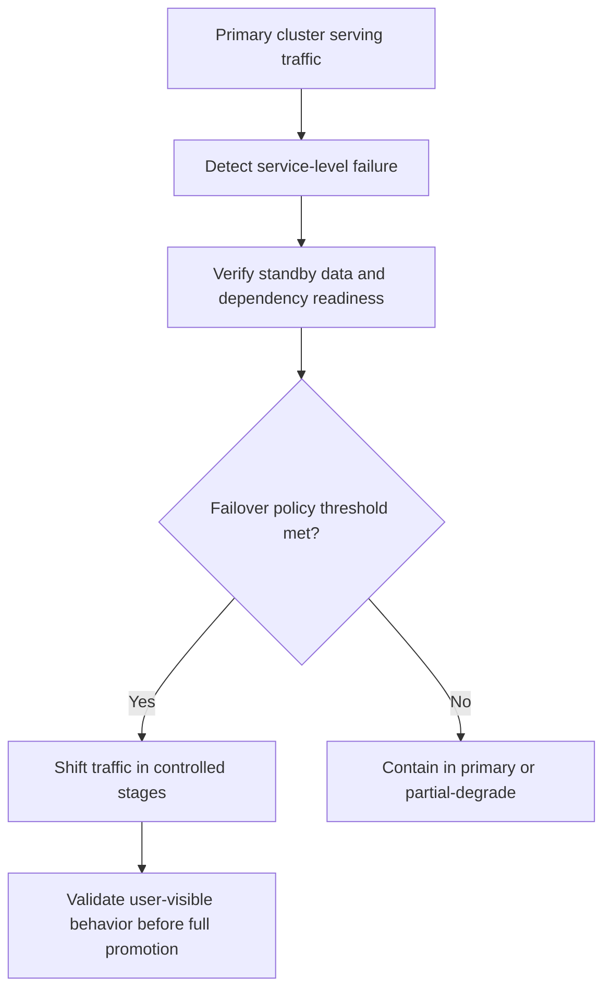

Part 2 is where multi-cluster design stops being a resilience story and becomes a failover discipline.

Running the same workload in more than one cluster does not automatically give you safe failover.
It often just gives you more places where readiness, routing, state replication, and operator assumptions can drift apart.

## Quick Summary

| Decision area | Safer default | Why |
| --- | --- | --- |
| Health signal for failover | use end-to-end readiness, not pod liveness alone | healthy pods can still be unable to serve production traffic |
| Traffic movement | separate detection from failover execution | automatic traffic shifts on weak signals are expensive |
| Standby posture | keep dependencies and data path explicit | a warm cluster without ready dependencies is not a standby |
| Cross-cluster design | decide what can degrade and what cannot | full failover is often unnecessary and harder than partial failover |
| Operator workflow | rehearse traffic return as well as failover | failback is often riskier than the initial cutover |

The practical rule is this:
do not ask DNS, GSLB, or service mesh routing to solve problems your application dependency model has not solved first.

## What Part 2 Is Really About

Part 1 usually explains why teams want multiple clusters:

- regional resilience
- maintenance isolation
- capacity headroom
- failure-domain separation

Part 2 asks a tougher question:
what signal are you actually trusting when you move traffic, and what assumptions must already be true in the target cluster?

That means getting explicit about:

- data replication lag
- secret and config parity
- third-party dependency reachability
- asynchronous job ownership
- readiness beyond "the container started"

If those are implicit, failover becomes a gamble with better branding.

## Pod Health Is Not Failover Readiness

Pods can be green while the service is still not fit to take production traffic.

Common examples:

- caches are cold and request latency is far above normal
- the cluster can serve reads but not writes because the primary datastore path is unavailable
- background workers are still catching up and user-visible state is incomplete
- an upstream dependency is region-local and not reachable from the standby cluster

This is why failover checks should include service-level readiness, not just workload-level liveness.

## Separate Detection From Traffic Movement

Teams often wire health signals directly into routing.
That sounds elegant until one short-lived signal blip swings traffic across regions or clusters unnecessarily.

A better model is:

- detection decides whether the primary is unhealthy
- policy decides whether the failure is severe enough to move traffic
- orchestration executes the traffic move
- humans keep the authority to pause or reverse it

That separation gives you time to distinguish a transient issue from a genuine failover event.

## Data and Dependency Boundaries Must Be Written Down

Every multi-cluster plan should answer these questions explicitly:

1. what data is replicated, and at what lag
2. what writes are allowed in the secondary cluster
3. which dependencies are global, regional, or cluster-local
4. which workloads can run active-active and which must stay single-writer
5. what degraded mode is acceptable if full failover is unsafe

Without those answers, a failover plan is mostly an optimistic routing diagram.

## A Practical Hardening Pattern

The crucial middle step is verification of the standby.
Healthy nodes and ready pods are not enough if the data path, background processing, or dependency topology is still incomplete.

## Failure Modes That Show Up in Production

### False failover triggers

One noisy probe or a short routing issue causes the control plane to move traffic unnecessarily.
Now you have a failover event layered on top of a recoverable incident.

### Standby cluster with stale assumptions

The manifests are present, but the standby cluster has outdated config, weaker node pools, or untested dependency access.
The first real failover becomes the first real validation.

### Split-brain write behavior

Both clusters appear healthy enough to accept writes, but the ownership rules for primary write responsibility were never fully enforced.

### Failback chaos

Teams rehearse moving traffic away from the primary but not returning it.
By the time failback is needed, caches, jobs, and reconciliation paths have drifted.

## Failure Drill Worth Running

Run a controlled game day that includes:

1. partial primary degradation where some APIs still work
2. a standby cluster with intentional data lag
3. a third-party dependency reachable only from one region

Then verify:

- whether failover triggers only on user-visible failure, not just infrastructure noise
- whether operators can choose degraded mode instead of full movement
- whether dashboards show data lag, request success, and traffic split together
- whether failback steps are clear before the initial failover is considered complete

If the team cannot explain which user journeys are safe in the standby cluster, the architecture is not really failover-ready.

## Operator Checklist

- end-to-end readiness signal exists for failover decisions
- data lag and dependency reachability are visible before traffic movement
- single-writer and active-active assumptions are documented
- partial-degradation mode is defined where full failover is unsafe
- traffic shift can happen gradually, not only as a big bang
- failback is rehearsed and owned

## Key Takeaways

- Multi-cluster failover is a service-behavior problem, not just a routing problem.
- Healthy pods are not the same thing as a ready standby.
- Detection, decision, and traffic movement should not be collapsed into one step.
- Part 2 is about proving that the target cluster can safely carry real user journeys before you trust automation.
