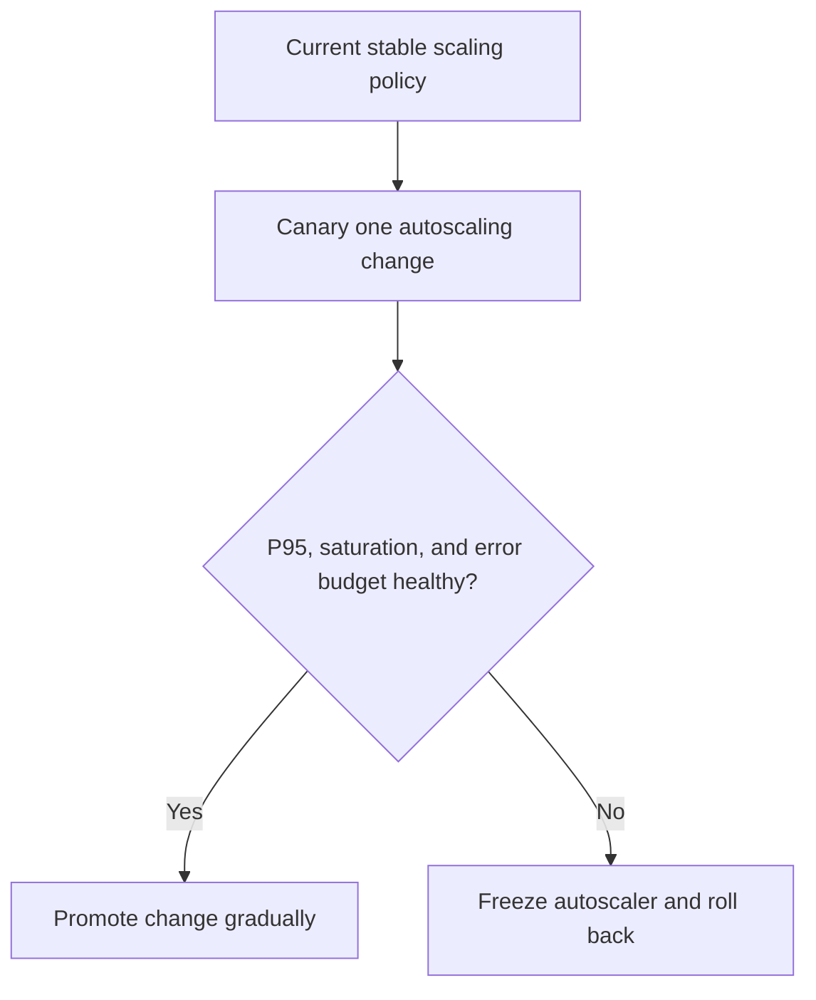

---
categories:
- Kubernetes
- Platform
- Backend
date: 2026-09-26
seo_title: HPA/VPA interactions and autoscaling anti-patterns (Part 3) - Advanced
  Guide
seo_description: Advanced practical guide on hpa/vpa interactions and autoscaling
  anti-patterns (part 3) with architecture decisions, trade-offs, and production patterns.
tags:
- kubernetes
- platform-engineering
- reliability
- backend
- operations
title: HPA/VPA interactions and autoscaling anti-patterns (Part 3)
toc: true
toc_icon: cog
toc_label: In This Article
header:
  overlay_image: "/assets/images/java-advanced-generic-banner.svg"
  overlay_filter: 0.35
  show_overlay_excerpt: false
  caption: Kubernetes Engineering for Backend Platforms
---
Part 3 is where autoscaling stops being a tuning exercise and becomes a governance problem.
By this point, the team usually understands HPA, VPA, and the obvious anti-patterns.
The harder question is how to keep scaling behavior safe after the first rollout, the first noisy tenant, and the first incident where "the autoscaler did something weird" is not an acceptable explanation.

HPA and VPA are both useful.
They are also both control loops.
If you let multiple loops change workload shape without clear policy boundaries, they will happily destabilize production together.

## Quick Summary

| Decision area | Safer default | Why |
| --- | --- | --- |
| HPA + VPA on the same deployment | use HPA actively, keep VPA in recommendation mode first | avoid two controllers mutating the same assumptions at once |
| CPU-based HPA with low CPU requests | avoid | throttling and request mismatch create false scaling signals |
| Memory-driven scaling with unstable heap behavior | be conservative | memory reacts slowly and bad limits create eviction cliffs |
| Scaling policy rollout | change one lever at a time | otherwise operators cannot explain which controller caused the shift |
| Incident response | allow manual override and freeze rules | an autoscaler should not keep fighting the recovery plan |

The practical rule is simple:
if you cannot explain which controller owns which decision, you do not yet have a production-grade autoscaling policy.

## What Part 3 Is Really About

Part 1 and Part 2 usually answer these questions:

- what signal should drive scaling
- what anti-patterns create bad recommendations
- how do HPA and VPA influence runtime behavior

Part 3 asks a different question:
how do we operate these choices safely over time?

That means writing down:

- who is allowed to change scaling policy
- which metrics are promotion gates
- when VPA recommendations are reviewed versus auto-applied
- when autoscaling should be paused during an incident

Without those rules, even a technically correct autoscaler setup becomes operationally fragile.

## Start With Control-Loop Ownership

The first production mistake is treating HPA and VPA as independent features.
They are not.
They are controllers making decisions based on a shared workload.

Give each controller an explicit job:

- HPA owns replica count
- VPA owns recommendation visibility first, and only later resource mutation where justified
- humans own exception handling, promotion, and rollback

That ownership split prevents a familiar failure mode:
HPA reacts to CPU pressure caused by bad requests, while VPA simultaneously rewrites requests and limits, changing the signal HPA is using.

If both loops are free to "help" at once, the system becomes harder to reason about right when it is already under stress.

## A Sensible Production Policy

For most services, a safer progression looks like this:

1. establish stable HPA behavior first
2. enable VPA in recommendation mode
3. review recommendations over real traffic cycles
4. apply selected request changes manually or in tightly controlled windows
5. automate only after the workload shape is well understood

That policy is boring.
Boring is good.
Autoscaling incidents are usually caused by too much automation too early, not too little.

## When HPA and VPA Fight Each Other

The most common sources of controller conflict are:

### CPU requests that are too low

If requests are artificially low, CPU utilization percentages become noisy and misleading.
The workload may scale because it is throttled, not because demand truly increased.

### VPA recommendations applied during unstable periods

If VPA learns from traffic spikes, bad warmup windows, or one-off incidents, its recommendations may encode crisis behavior instead of normal behavior.

### Memory-heavy services with poor headroom policy

Memory is not as forgiving as CPU.
A bad memory policy can lead to:

- repeated OOM kills
- eviction churn
- slow restart loops
- misleading HPA reactions because readiness keeps flapping

### Multiple simultaneous changes

Changing replica policy, resource requests, and rollout strategy in the same release destroys causality.
If the service behaves badly, nobody knows which change actually did it.

## A Better Rollout Pattern

Treat autoscaling changes the way you treat infrastructure migrations: one control surface at a time.

Good canary checks for autoscaling changes include:

- p95 and p99 latency
- pod restart count
- throttle rate
- OOM or eviction count
- scale event frequency
- time to steady state after traffic shifts

If the team only watches average CPU, it is not really validating autoscaling.

## A Safe Relationship Between HPA and VPA

In practice, these patterns tend to be easier to operate:

| Workload type | Safer posture |
| --- | --- |
| stateless API with bursty CPU demand | HPA active, VPA recommend-only |
| memory-sensitive service with stable request shape | HPA active, VPA recommendations reviewed manually |
| batch or offline worker | VPA may be more valuable than HPA |
| highly latency-sensitive service | minimize automated resource mutation during peak windows |

The key is not memorizing a universal rule.
It is avoiding uncontrolled interaction between controllers.

## Incident Rules You Want Written Down Before the Incident

Autoscaling policy should include explicit emergency behavior.

Operators need to know:

- when to freeze HPA
- when to ignore VPA recommendations
- when a manual replica override is allowed
- when request changes require a follow-up deployment instead of in-place trust

That matters because during an incident, the autoscaler is often still following yesterday's assumptions while the humans are trying to solve today's failure mode.

If the runbook says only "check HPA status," the runbook is not good enough.

## Failure Modes That Keep Showing Up

### Scaling on the wrong metric

A metric may be measurable without being decision-worthy.
CPU is easy to observe, but sometimes queue depth, inflight requests, or concurrency limit saturation better represent real demand.

### VPA auto mode on workloads that cannot tolerate surprise restarts

If a service has expensive warmup, heavy cache priming, or strict latency SLOs, uncontrolled resource mutation can cost more than the recommendation helps.

### Autoscaling and disruption budgets working against each other

Teams often tune scaling and disruption separately.
Then a rollout or node drain happens and the policies collide.

### No explicit min/max safety rails

An HPA without carefully chosen floors and ceilings is not a scaling strategy.
It is an invitation to discover production limits live.

## What the First Dashboard Should Show

At minimum, expose:

- replica count over time
- desired versus actual replicas
- CPU throttling
- memory pressure and OOM kills
- HPA events
- VPA recommendation deltas
- request and limit history by deployment revision

Operators should be able to answer:
"Did demand rise, did the controller overreact, or did resource settings make the signal meaningless?"

If the dashboard cannot answer that, the autoscaling setup is under-observed.

## A Practical Governance Rule

Do not treat autoscaling configuration as ordinary YAML hygiene.
Treat it as control-plane policy with:

- code review ownership
- promotion gates
- rollback criteria
- incident freeze rules

That framing is what keeps HPA and VPA from becoming hidden sources of instability.

## Key Takeaways

- HPA and VPA are interacting control loops, not isolated features.
- The safest default is usually HPA active with VPA in recommendation mode first.
- Change one scaling lever at a time so operators can explain causality.
- Autoscaling policy needs runbooks, freeze rules, and promotion gates just as much as application code does.
