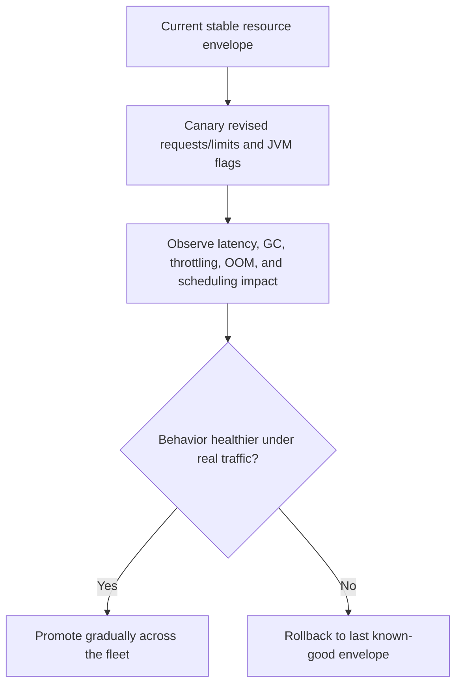

Part 3 is where JVM resource tuning stops being a benchmark exercise and becomes a production change-management problem.

By now the team should understand requests, limits, headroom, and the JVM-specific traps around heap sizing and container awareness.
The harder part is rolling those settings out safely, keeping ownership clear, and making sure each "tuning improvement" does not quietly destabilize scheduling, probes, autoscaling, or incident recovery.

## Quick Summary

| Decision area | Safer default | Why |
| --- | --- | --- |
| Ownership of tuning | split between app and platform, but document it | JVM settings and cluster behavior influence each other |
| Rollout style | canary resource changes | resource edits can alter latency, scheduling, and restart behavior at once |
| JVM memory model | budget beyond heap alone | metaspace, threads, buffers, and native memory still count |
| Success metric | use latency, restart, throttle, and OOM signals together | one metric alone hides tradeoffs |
| Rollback posture | predefine the previous resource envelope | rollback during node pressure is slower than teams expect |

Part 1 and Part 2 establish the mechanics.
Part 3 is about operating them responsibly.

## What Part 3 Is Really About

Changing requests and limits for a JVM service changes more than cost.
It can also change:

- pod placement
- node packing density
- HPA behavior
- CPU throttling frequency
- GC behavior
- warmup time after restart
- eviction risk under cluster pressure

That is why resource tuning should be treated like a production behavior change, not a YAML cleanup.

## Resource Changes Are Cluster Changes

A service team may think it is only increasing memory requests by a few hundred MiB.
The platform sees something else:

- fewer pods fitting on the same nodes
- different eviction priorities
- different rollout timing during deployments
- a new interaction with cluster autoscaler or HPA

Those effects are not side notes.
They are part of the change.

If the rollout review covers only the JVM flags and not the scheduling consequences, it is incomplete.

## JVM Tuning Needs a Wider Memory Model

Heap is only one part of the container budget.
A safer memory model accounts for:

- Java heap
- metaspace
- code cache
- direct buffers
- thread stacks
- JNI or native allocations
- sidecar overhead if present

A service can keep heap below target and still get killed because the container limit was designed around heap alone.

This is one reason generic platform defaults fail JVM workloads.
The runtime is container-aware, but it is not magic.

## A Better Rollout Pattern

Treat resource changes like controlled experiments.

The point of the canary is not just to catch crashes.
It is to catch second-order effects like slower startup, worse p99 latency, or reduced bin-packing efficiency.

## Ownership Must Be Shared but Explicit

Good JVM tuning programs usually have two owners:

- the application team owns runtime behavior, GC posture, and app-level load characteristics
- the platform team owns scheduling policy, cluster headroom, and policy guardrails

What fails is the in-between zone where each side assumes the other validated the risky part.

Write down who approves:

- heap and JVM flag changes
- request and limit changes
- autoscaling threshold changes caused by new resource baselines
- rollout pause and rollback decisions

If ownership is implicit, incident response gets slow right when the service is already unstable.

## Common Governance Failures

### Benchmark-only tuning

Settings look great in load tests but were never validated against noisy neighbors, node pressure, or real rollout conditions.

### Heap-centric budgeting

The team optimizes `-Xmx` and ignores direct memory, thread count, or sidecar footprint.
The container still dies, just with nicer heap graphs.

### Resource changes bundled with unrelated releases

A new code path, new JVM flags, and new limits all ship together.
When latency shifts, nobody knows which factor actually caused it.

### Rollback without capacity awareness

The previous settings were safe last week, but the cluster now has different headroom.
Rollback works on paper and fails in the scheduler.

## Failure Drill Worth Running

Before broad rollout, simulate:

1. a canary under burst traffic
2. a node-pressure event during deployment
3. a rollback while the cluster is already partially full

Then verify:

- whether startup, readiness, and GC behavior still look healthy
- whether the canary changes HPA decisions unexpectedly
- whether operators can compare new and old resource envelopes quickly
- whether rollback still schedules cleanly without waiting for emergency capacity

If the team cannot answer "what changed besides cost?" the rollout is under-specified.

## Operator Checklist

- resource tuning review includes scheduling and autoscaling impact
- memory budget covers heap plus non-heap usage
- canary dashboards show latency, restart count, throttle rate, GC, and OOM together
- rollout changes one resource policy surface at a time
- rollback points to a known-good resource envelope
- application and platform ownership are both explicit

## Key Takeaways

- JVM requests and limits are cluster-behavior settings, not just application settings.
- Heap-only thinking is one of the fastest ways to mis-size JVM containers.
- Resource tuning deserves canary rollout, telemetry gates, and explicit rollback just like code changes.
- Part 3 is about making performance tuning safe enough to operate repeatedly, not just once.
