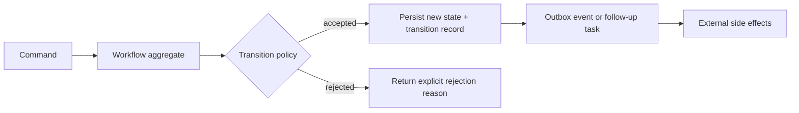

---
categories:
- Java
- Design
- Architecture
date: 2026-10-08
seo_title: State-machine-driven workflow engines in Java - Advanced Guide
seo_description: Advanced practical guide on state-machine-driven workflow engines
  in java with architecture decisions, trade-offs, and production patterns.
tags:
- java
- lld
- oop
- architecture
- design
title: State-machine-driven workflow engines in Java
toc: true
toc_icon: cog
toc_label: In This Article
header:
  overlay_image: "/assets/images/java-advanced-generic-banner.svg"
  overlay_filter: 0.35
  show_overlay_excerpt: false
  caption: Advanced LLD and OOP Design in Java
---
Most workflow systems do not fail because the state graph is complicated.
They fail because the transition rules, side effects, and recovery semantics get mixed together until nobody can explain what is still legal after a partial failure.

That is why a good workflow engine starts with a boring question:
what owns the state transition, and what must be true after every accepted command?

## Quick Summary

| Decision area | Strong default | Risky default |
| --- | --- | --- |
| State modeling | explicit states and legal transitions | boolean flags and hidden status combinations |
| Transition logic | one transition boundary per aggregate or workflow instance | rules scattered across services and handlers |
| Side effects | derive side effects from accepted transitions | perform remote calls inside transition logic |
| Recovery | persist transition result before publishing effects | assume the network and database succeed together |
| Observability | transition history, rejection reasons, age-in-state metrics | only log "workflow updated" |

Part 1 is about the baseline shape.
Before retries, timers, and compensation are added, the team needs one transition model that is easy to reason about under change.

## When a Workflow Engine Is the Right Tool

Reach for a state-machine model when all three are true:

1. the entity has a small but meaningful set of legal states
2. commands are only valid in some of those states
3. auditors, operators, or downstream systems care how the entity moved, not just where it ended up

Typical examples:

- order fulfillment
- payment review and approval
- document publishing
- onboarding or KYC pipelines
- internal request lifecycles

If the process is just "do three things in sequence and fail fast," a plain service method is usually enough.
The workflow model earns its cost when illegal transitions, asynchronous work, and recovery rules must stay explicit over time.

## The Design Mistake That Creates Most Workflow Debt

Teams often start with a single `status` field and a few controller checks:

```java
if (order.getStatus() == Status.PENDING) {
    paymentService.capture(order);
    order.setStatus(Status.PAID);
}
```

This looks harmless for a while.
Then the domain grows:

- some transitions require approval
- some are retryable
- some must emit events
- some must reject duplicate commands
- some are no longer synchronous

Now the transition rule no longer lives in one place.
It leaks into controllers, listeners, job runners, and compensating scripts.
That is the moment the workflow stops being a model and becomes a collection of tribal assumptions.

## Baseline Architecture

The safest baseline is simple:
one workflow instance owns the current state, one transition function decides legality, and accepted transitions produce durable effects for later delivery.



Two boundaries matter here:

- transition decision boundary: pure domain decision about whether the command is legal
- side-effect boundary: everything that talks to the outside world after the transition is durably recorded

That split is what keeps partial failure understandable.

## What to Model Explicitly

A workflow engine does not need a giant framework on day one.
It does need a few explicit concepts:

- current state
- command or event attempting a transition
- transition result
- rejection reason for illegal moves
- durable history or audit record

A practical baseline in Java can stay small:

```java
public enum OrderState {
    DRAFT,
    SUBMITTED,
    APPROVED,
    REJECTED,
    FULFILLED
}

public record TransitionResult(
        boolean accepted,
        OrderState newState,
        String reason) {

    public static TransitionResult accept(OrderState newState) {
        return new TransitionResult(true, newState, null);
    }

    public static TransitionResult reject(String reason) {
        return new TransitionResult(false, null, reason);
    }
}

public final class OrderWorkflow {
    private OrderState state;

    public TransitionResult submit() {
        if (state != OrderState.DRAFT) {
            return TransitionResult.reject("only draft orders can be submitted");
        }
        state = OrderState.SUBMITTED;
        return TransitionResult.accept(state);
    }
}
```

This is intentionally modest.
The important discipline is not the enum itself.
It is that the object owning the state is also the place where legal transitions are defined.

## Keep Side Effects Outside the Transition Function

One of the most expensive workflow mistakes is mixing domain state change with remote side effects:

- charging a card inside `approve()`
- sending email before the transaction commits
- publishing Kafka events before the new state is durable

That design creates ambiguous outcomes:

- payment succeeded but state update failed
- event published but workflow row rolled back
- email sent for a transition that never committed

The cleaner rule is:
accept the transition first, persist it, then deliver the side effect from an outbox, task table, or follow-up processor.

This does not make failure disappear.
It makes failure visible and recoverable.

## Good Rejection Semantics Matter

A workflow engine should be good at saying "no."
If illegal transitions are handled with silent no-ops, generic `400`, or ad hoc exceptions, the model becomes hard to trust.

Reject explicitly when:

- the command is invalid for the current state
- a precondition is missing
- a required version is stale
- the actor is not allowed to perform the step

That gives operators and client code a stable contract.
It also makes race conditions easier to debug because the workflow can report what state it actually saw.

## Production Signals to Add Early

The first version should already expose signals that tell you whether workflows are healthy:

- transition acceptance vs rejection counts
- time spent in each state
- count of stuck instances past an SLA
- outbox lag for follow-up actions
- duplicate command rate

If a workflow engine only tells you the current status column, you will struggle during incidents.
Operators usually need to know:

- what transition was attempted
- why it was rejected
- what the previous state was
- whether a follow-up side effect is still pending

## Failure Modes Worth Designing For

The baseline model should survive these common failures:

### Duplicate commands

A user retries `approve`, a worker retries a message, or an API gateway repeats a request.
The engine should treat command identity and idempotency as part of the design, not a later enhancement.

### Stale reads

Two workers act on the same workflow instance.
Without version checks or optimistic locking, both may think the transition is legal.

### Long-running side effects

The workflow state moves quickly, but the actual downstream action is slow.
That means operators need to distinguish "state accepted" from "side effect complete."

### Hidden timers

Expiry, escalation, and retries are still transitions.
If timers are implemented as separate scripts without using the same transition rules, the model forks into two realities.

## A Practical Decision Rule

A workflow design is on the right track when you can answer these questions in one sentence each:

1. who owns the authoritative state?
2. where is transition legality decided?
3. how are illegal moves reported?
4. when do external side effects happen?
5. how do we replay or recover after partial failure?

If those answers are spread across five services and three frameworks, the system probably is not modeled clearly enough yet.

## Part 1 Checklist

- state names represent real business meaning, not technical phases
- legal transitions are defined in one owned boundary
- side effects happen after durable state change
- rejection reasons are explicit and testable
- transition history or audit events are recorded
- operators can measure stuck workflows and delayed effects

## Key Takeaways

- A workflow engine is mainly about preserving transition semantics under change, not drawing a fancy state diagram.
- The most important split is between transition decision and external side effects.
- If the system cannot explain illegal transitions and partial failures clearly, it is not ready for scale yet.
- Start with one authoritative transition boundary before adding orchestration features.
