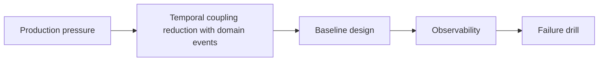

Temporal coupling reduction with domain events matters when object design has to hold up under real change, not just compile in a small example. The important design pressure is usually invariants, testability, and where coupling is allowed to exist.

---

## Problem 1: Temporal coupling reduction with domain events

Problem description:
We want temporal coupling reduction with domain events to hold up as the domain model evolves, the codebase grows, and multiple teams touch the same design. This part focuses on the baseline model and the safe default shape.

What we are solving actually:
We are establishing the core boundary, deciding what must stay explicit, and choosing a baseline that is easy to observe. For low-level design, the hidden risk is accidental coupling, weak invariants, and objects that look clean until behavior gets more complex.

What we are doing actually:

1. make the domain model explicit: identify the ownership boundary and the non-negotiable invariant
2. make the domain model explicit: choose the simplest baseline design that preserves correctness
3. make the domain model explicit: make observability visible from the first implementation
4. make the domain model explicit: validate the baseline with one concrete failure drill

---

## Why This Topic Matters

- object design has to preserve invariants under change, not just look elegant initially
- good boundaries reduce rewrite cost when behavior expands later
- testability often reveals whether the model is actually cohesive

---

## Architecture Model



The model is deliberately centered on boundary, invariant, and change pressure so temporal coupling reduction with domain events reads like a design decision instead of an object diagram.
That helps keep future refactors anchored to one rule the team actually cares about preserving.

---

## Practical Design Pattern

```java
public final class DesignBoundary {
    public void apply(Command command) {
        // Preserve invariants for: Temporal coupling reduction with domain events
    }
}
```

The code stays compact so the design boundary for temporal coupling reduction with domain events is visible without framework noise.
A richer implementation is fine later, but only if it keeps the invariant easier to test instead of easier to forget.

---

## Failure Drill

Baseline drill: change one domain rule and verify the design adapts without leaking invariants across unrelated classes for temporal coupling reduction with domain events.

That drill matters early, before rollout assumptions harden into defaults because object designs for temporal coupling reduction with domain events often look tidy until one rule changes and the invariant starts leaking across unrelated classes.

---

## Debug Steps

Debug steps:

- write one failing invariant test before changing the design while validating temporal coupling reduction with domain events
- inspect whether responsibilities are gathering in one object for convenience while validating temporal coupling reduction with domain events
- prefer boundaries that stay understandable during refactor pressure while validating temporal coupling reduction with domain events
- use tests to expose temporal coupling or hidden dependencies while validating temporal coupling reduction with domain events

---

## Production Checklist

- one invariant stated in code and in tests
- boundary between aggregate or collaborators kept explicit
- change-cost signal identified before adding extra abstractions
- refactor path that does not weaken the model during rollout

---

## Key Takeaways

- Temporal coupling reduction with domain events should be designed as a production decision, not just an implementation detail
- object design should preserve invariants and reduce long-term change cost
- start from a measurable baseline before optimizing

---

## Design Review Prompt

A useful final check for temporal coupling reduction with domain events is whether the ownership boundary, rollback path, and main SLO signal can all be explained in three sentences. If not, the design is probably still too implicit.
