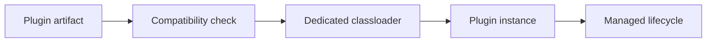

Part 1 established the baseline:
plugin systems live or die by boundary discipline, not by clever discovery code.

Part 2 is where the easy version stops working.
Once plugins evolve independently, the hard questions show up:

- what API is truly stable?
- what may cross the classloader boundary?
- how are incompatible plugins rejected?
- who owns lifecycle and failure isolation?

If those answers are vague, the plugin model usually turns into a runtime coupling trap.

## Quick Summary

| Design question | Good default | Common failure |
| --- | --- | --- |
| What classes may cross the boundary? | only host API and simple value types | plugin internals leak into host code |
| How is compatibility checked? | explicit version/capability contract | hope classloading fails loudly enough |
| Who owns plugin lifecycle? | host runtime | plugins self-manage shared resources |
| How are failures contained? | isolate and disable per plugin | one broken plugin corrupts the whole process |

The key rule is:
classloader isolation only helps when the API boundary is stricter than the implementation boundary.

## The Stable API Jar Matters More Than the Loader

Teams often spend more time on loading mechanics than on contract design.
That is backwards.

The host needs a small, boring, stable API surface that plugins implement.

Example:

```java
public interface PricingPlugin {
    String id();
    Money quote(PricingRequest request);
}
```

That interface should be:

- versioned deliberately
- free of host internals
- small enough to keep compatible
- expressive enough to avoid constant plugin breakage

If the plugin contract is unstable, classloader tricks do not save the architecture.

## What Should Cross the Boundary

A healthy plugin boundary usually allows:

- host-owned interfaces
- simple request/response DTOs
- explicit extension-point exceptions
- immutable value types

A dangerous boundary allows:

- host ORM entities
- framework container internals
- mutable shared state
- plugin-private utility types masquerading as API

That is how "plugin support" quietly turns into binary coupling.

## The Compatibility Check Should Be Explicit

Do not rely on `ClassNotFoundException` as your compatibility strategy.

Use an explicit descriptor:

```java
public record PluginDescriptor(
        String pluginId,
        String apiVersion,
        Set<String> capabilities
) {}
```

Then validate before activation:

```java
public final class PluginCompatibility {
    public void verify(PluginDescriptor descriptor) {
        if (!"2.x".equals(descriptor.apiVersion())) {
            throw new IllegalStateException("Unsupported plugin API version: " + descriptor.apiVersion());
        }
    }
}
```

That gives the runtime a readable rejection path instead of a pile of low-level linkage failures.

## A Better Loading Model

Think in terms of four responsibilities:



Loading is only step three.
Most runtime pain is actually in steps two and five.

## Failure Isolation Is a Design Requirement

A plugin architecture is not just about extensibility.
It is about limiting blast radius.

The host should be able to:

- reject one incompatible plugin
- disable one unhealthy plugin
- observe one plugin's errors separately
- unload or restart one plugin without corrupting host state

That means plugin code should not own global singletons, unmanaged thread pools, or static caches that live beyond the plugin lifecycle.

## Classloader Boundaries Do Not Solve State Ownership

This is the subtle trap.
Teams see separate classloaders and assume that means "good isolation."

It does not, if the plugin still reaches into:

- shared databases with uncontrolled schemas
- mutable host registries
- process-wide static state
- side effects with no host mediation

Classloaders isolate types.
They do not isolate operational consequences.

## A Practical Java Shape

```java
public interface Plugin {
    PluginDescriptor descriptor();
    void start(PluginContext context);
    void stop();
}

public final class PluginRuntime {
    public LoadedPlugin load(Path artifact) {
        PluginDescriptor descriptor = descriptorReader.read(artifact);
        compatibility.verify(descriptor);

        PluginClassLoader loader = classLoaderFactory.create(artifact);
        Plugin plugin = pluginFactory.instantiate(loader, descriptor);

        plugin.start(pluginContext);
        return new LoadedPlugin(descriptor, loader, plugin);
    }
}
```

The important part is not the exact factory arrangement.
It is that the host owns:

- compatibility
- lifecycle
- context
- unloading

The plugin only owns plugin behavior.

## Where Plugin Architectures Usually Break

### Boundary types keep growing

If every release adds more host classes to the plugin API, the boundary is not stable.

### Host and plugin share mutable state casually

That is how debugging becomes impossible.

### Unloading never really works

Lingering thread locals, executors, or static caches keep old classloaders alive.

### Versioning is social, not technical

If compatibility depends on "everyone remembering the rule," it will fail under release pressure.

## Testing Strategy

Test the plugin system at three levels:

1. API contract tests
2. compatibility and rejection tests
3. lifecycle tests under load and failure

Useful cases include:

- plugin compiled against unsupported API version
- plugin throws during startup
- plugin leaks resources across stop/start cycles
- host disables one plugin while others continue normally

## Practical Rule of Thumb

The plugin boundary should be narrower than teams first want and more explicit than they first expect.

If plugins need deep host object access to remain useful, the system probably has not found the right extension point yet.

## Key Takeaways

- The stable API contract matters more than the loading trick.
- Classloader isolation helps with types, not with operational ownership.
- Compatibility checks should be explicit and readable before activation.
- A plugin runtime should own lifecycle, failure isolation, and unloading discipline.
