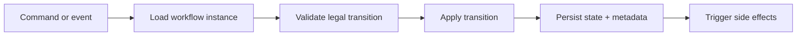

Part 1 covered the baseline workflow-engine shape:
states, transitions, guards, and a durable understanding of what is legal next.

Part 2 is where workflow engines become real systems instead of elegant diagrams.
The hard problems are no longer "how do I model a transition?"
They are:

- what happens during retries?
- how do I persist progress?
- how do I stop duplicate commands from replaying work?
- what do operators need to diagnose a stuck instance?

That is where most naive state-machine designs start to bend.

## Quick Summary

| Pressure | Good design move | Common mistake |
| --- | --- | --- |
| retries and duplicate delivery | transition idempotency | assume commands arrive once |
| persistence | store state plus transition metadata | only store current status string |
| long-running workflows | explicit timeout/retry model | hide waiting inside ad hoc logic |
| operator debugging | transition history and failure reason | make status readable only in code |

The practical rule is:
the state machine should decide legality, but the engine must also make progress observable and repeatable.

## The First Hardening Step: Separate State Rules From Engine Concerns

A workflow engine usually has two layers:

1. domain rules:
   what transitions are legal?
2. runtime concerns:
   persistence, retries, deduplication, timeout handling, scheduling

The design gets messy when those layers blur.

If state classes start owning database writes, retry loops, and remote calls, the engine becomes harder to test and harder to operate.

A better split is:

- state machine decides the next legal state
- engine coordinates side effects and durable progress

## Idempotency Is Not Optional

The moment a workflow is triggered by messages, retries, or operator replay, duplicate commands become normal.

If the engine cannot safely answer "have I already applied this transition request?", it is not production-ready.

Example shape:

```java
public record TransitionCommand(
        String workflowId,
        String commandId,
        String transitionName
) {}

public final class WorkflowEngine {
    public void apply(TransitionCommand command) {
        if (transitionLog.alreadyApplied(command.workflowId(), command.commandId())) {
            return;
        }

        WorkflowInstance instance = repository.load(command.workflowId());
        WorkflowState next = stateMachine.transition(instance.state(), command.transitionName());

        repository.save(instance.withState(next));
        transitionLog.record(command.workflowId(), command.commandId(), command.transitionName());
    }
}
```

The exact storage can vary.
The design point is stable:
transition application must tolerate replay.

## Persist More Than the Current State

Teams often store only:

- workflow ID
- current state

That is rarely enough.

Useful persisted fields often include:

- current state
- last successful transition
- failure reason
- retry count
- deadlines or timeout timestamps
- correlation or command IDs

Operators do not need only "where is it now?"
They also need "why did it get stuck there?"

## Timeouts and Waiting States Must Be Explicit

Long-running workflows often need states like:

- `WAITING_FOR_PAYMENT`
- `WAITING_FOR_APPROVAL`
- `RETRY_SCHEDULED`
- `FAILED_TERMINAL`

That is healthier than hiding timing behavior in background code that mutates state later.

If waiting behavior is real, model it explicitly.
The engine should know:

- when the workflow entered the waiting state
- what event can unblock it
- when to escalate or time out

## A Better Operational Shape



This sequence matters because it makes the engine answerable under incident pressure.
If the team cannot explain whether side effects happen before or after durable state change, the design is not ready.

## Where Workflow Engines Usually Fail

### Side effects inside transition logic

If a state transition directly calls remote systems and then mutates in-memory state, retries become ambiguous.

### No replay discipline

Without idempotent command handling, operators become afraid to retry anything.

### Status values without semantics

A status enum is not enough if no one can explain:

- what is allowed next
- who owns recovery
- whether the state is terminal or waiting

### One giant engine class

If every new workflow special case lands in one service, the "engine" is really just a new monolith.

## Testing Strategy

Useful tests are not only "transition A goes to B."

Test:

1. illegal transitions fail clearly
2. duplicate commands are harmless
3. timeout transitions behave deterministically
4. persistence and replay restore the same next-state decision
5. one failed side effect does not silently corrupt workflow progress

That test mix usually reveals whether the design is a toy state machine or a real workflow runtime.

## When a Full Workflow Engine Is Overkill

Do not build one just because the domain has statuses.

Plain application logic is often enough when:

- transitions are few
- no long waits exist
- retries are local and simple
- operator tooling is not required

The engine becomes worth it when lifecycle rules, replay, and observability are real operating concerns.

## Practical Rule of Thumb

Model the workflow state machine explicitly, but keep runtime concerns explicit too.

If the design hides retry semantics, timeout policy, or persistence ordering inside "clean" abstractions, it is usually optimizing the wrong thing.

## Key Takeaways

- Workflow engines need idempotency and persistence discipline, not just pretty transition diagrams.
- Persist enough metadata for replay, recovery, and operator diagnosis.
- Waiting, timeout, and retry states should be modeled explicitly when they are real.
- Keep transition legality separate from side-effect orchestration whenever possible.
