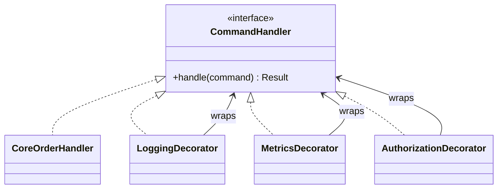

---
categories:
- Java
- Design Patterns
- Architecture
date: 2026-11-02
seo_title: Decorator pattern for observability and policy layering - Advanced Guide
seo_description: Advanced practical guide on decorator pattern for observability and
  policy layering with architecture decisions, trade-offs, and production patterns.
tags:
- java
- design-patterns
- architecture
- backend
- software-design
title: Decorator pattern for observability and policy layering
toc: true
toc_icon: cog
toc_label: In This Article
header:
  overlay_image: "/assets/images/java-advanced-generic-banner.svg"
  overlay_filter: 0.35
  show_overlay_excerpt: false
  caption: Advanced Design Patterns with Java
---
Decorator is useful when you want to add behavior around an operation without changing the underlying implementation or exploding inheritance trees.

That is a very real need in backend systems.
Observability, authorization, idempotency, rate limiting, and retries often want to wrap the same core action.

It is also a pattern that teams misuse quickly.
A few decorators can clarify layering.
Too many can turn debugging into archaeology.

## Quick Summary

| Question | Strong fit | Weak fit |
| --- | --- | --- |
| Do several cross-cutting concerns wrap the same core operation? | yes | no, each path is fundamentally different |
| Can each wrapper preserve the same interface? | yes | no, behavior shape changes too much |
| Is composition order important and visible? | yes | no, order is accidental |
| Will debugging through extra layers still be reasonable? | yes | no, stack behavior is already opaque |

Decorator works best when the concern is orthogonal to the business action, not when the wrapper is secretly changing the whole contract.

## A Good Example: Order Command Handling

Suppose the core operation is simple:

```java
public interface CommandHandler {
    Result handle(Command command);
}
```

Now several production concerns want to wrap it:

- structured logging
- metrics
- authorization
- idempotency

The core handler should still focus on business logic.
That is a good place for decorators.

## Structure at a Glance



That diagram is the real value:
many wrappers, one stable contract, explicit composition.

## A Practical Java Example

```java
public interface CommandHandler {
    Result handle(Command command);
}

public final class CoreOrderHandler implements CommandHandler {
    @Override
    public Result handle(Command command) {
        return Result.success();
    }
}

public abstract class CommandHandlerDecorator implements CommandHandler {
    protected final CommandHandler delegate;

    protected CommandHandlerDecorator(CommandHandler delegate) {
        this.delegate = delegate;
    }
}

public final class LoggingDecorator extends CommandHandlerDecorator {
    public LoggingDecorator(CommandHandler delegate) {
        super(delegate);
    }

    @Override
    public Result handle(Command command) {
        System.out.println("handling command " + command.id());
        return delegate.handle(command);
    }
}

public final class AuthorizationDecorator extends CommandHandlerDecorator {
    public AuthorizationDecorator(CommandHandler delegate) {
        super(delegate);
    }

    @Override
    public Result handle(Command command) {
        if (!command.authorized()) {
            throw new IllegalStateException("unauthorized");
        }
        return delegate.handle(command);
    }
}
```

Composition stays in one visible place:

```java
CommandHandler handler =
        new LoggingDecorator(
                new AuthorizationDecorator(
                        new CoreOrderHandler()));
```

That is the design rule that keeps decorator readable:
assembly must be obvious.

## What a Good Decorator Owns

A decorator should own one focused concern around the call boundary:

- log before and after
- measure duration
- reject unauthorized input
- enforce idempotency key checks

It should not absorb:

- unrelated orchestration
- half the business workflow
- hidden state mutation that later decorators depend on

If a decorator changes the meaning of the operation rather than wrapping it, the abstraction is probably drifting.

## Why Teams Reach for Decorator

The pattern is attractive because it offers:

- reuse across many handlers
- less repeated cross-cutting code
- a cleaner core implementation
- extension without subclass explosion

Those are real wins.
They just come with an operational cost:
every wrapper is another layer to reason about during incidents.

## The Hard Part: Composition Order

Order is not cosmetic.
It changes behavior.

Examples:

- authorization before logging may hide unauthorized attempts from normal request logs
- logging before authorization may record more audit detail
- metrics outside retries measure end-to-end latency
- metrics inside retries measure one attempt only

That is why decorators need one clearly owned assembly point.
If wrappers are stacked ad hoc in different places, the system may expose the same interface while behaving differently per path.

## Where Decorator Goes Wrong

### Too many tiny layers

Every wrapper is individually reasonable, but together they make the request path hard to trace.

### Hidden contract changes

One decorator starts swallowing exceptions, another starts retrying, a third rewrites results.
Now the interface is stable in name only.

### Debugging cost exceeds reuse benefit

If every incident requires stepping through six wrappers before reaching core logic, the pattern may be overused.

### Composition is scattered

If different entry points build different decorator stacks casually, behavior consistency disappears.

## Alternatives Worth Considering

### Plain composition in one service

Often better when there are only one or two cross-cutting concerns.

### AOP or interceptors

Useful when the concern is truly infrastructure-wide, though they can be even less visible than decorators if overused.

### Middleware or filter chains

Better when the concern is request-pipeline oriented rather than object-oriented behavior wrapping.

Decorator is strongest when the wrapped contract is stable and the added behavior is close to the domain boundary.

## A Practical Decision Rule

Use decorator when all of these are true:

1. the same interface should stay visible to callers
2. added behavior is orthogonal to the core action
3. wrapper order can be made explicit
4. debugging through the stack is still acceptable

If the concern changes the contract deeply or needs broad hidden orchestration, another pattern is usually better.

## Production Checklist

- core handler remains readable without wrapper knowledge
- each decorator owns one concern
- composition order is explicit and reviewable
- metrics and logs make wrapper behavior visible
- the team can explain the call stack during an incident
- simpler alternatives were considered before adding another layer

## Key Takeaways

- Decorator is valuable for layering cross-cutting concerns around a stable operation.
- Its biggest strength is composition without changing the core implementation.
- Its biggest risk is debugging cost and accidental contract drift.
- The pattern stays healthy only when wrapper responsibility and composition order are explicit.
