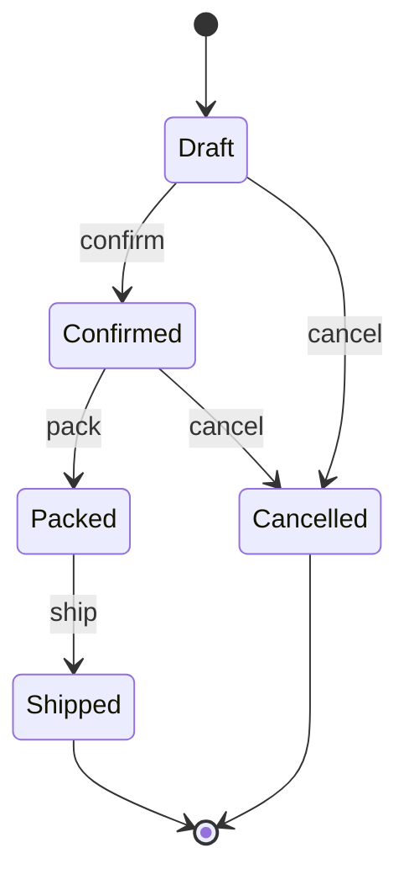

The State pattern earns its keep when business rules depend on lifecycle stage and those stage-specific rules keep leaking into `if` trees, scattered guards, or giant services.

It is not a synonym for "this object has states."
It is a way to make legal transitions and stage-specific behavior explicit in code.

## Quick Summary

| Question | Strong fit | Weak fit |
| --- | --- | --- |
| Do rules change by lifecycle stage? | yes, heavily | only one or two trivial branches |
| Do transitions need guarding? | yes | no, state is mostly informational |
| Is there real stage-specific behavior? | yes | no, one `switch` is clearer |
| Do multiple teams keep adding workflow rules? | yes | no, the model is stable and tiny |

The best mental model is:
each state owns the rules that are true *while the object is in that state*.

## When This Pattern Actually Helps

A workflow object becomes painful when the system keeps asking questions like:

- can a draft be published directly?
- can a cancelled order be refunded?
- can a shipped package change address?
- what audit event should happen during each transition?

At first, teams answer those questions with `if (status == ...)`.
Later, they have twenty such checks spread across services, controllers, and schedulers.

That is the point where State starts helping.
It consolidates:

- allowed transitions
- behavior that depends on lifecycle phase
- failure messages when a transition is illegal

## When State Is Overkill

Do not reach for this pattern just because an enum exists.

An enum plus one well-written `switch` is often better when:

- the lifecycle has very few transitions
- behavior is not spread across the system
- illegal transitions are rare
- the domain is stable and unlikely to grow

If the object only needs "draft vs published" and there are two guarded actions, a dedicated state hierarchy can be more ceremony than value.

> [!important]
> Use State when you are modeling workflow behavior, not when you are trying to make object-oriented code look more sophisticated.

## Example Pressure: Order Lifecycle

Suppose an order can move through:

- `Draft`
- `Confirmed`
- `Packed`
- `Shipped`
- `Cancelled`

Now add real rules:

- only drafts can be edited freely
- only confirmed orders can be packed
- shipped orders cannot be cancelled
- cancelled orders cannot accept any more commands

That is a workflow, not just a status field.

This is exactly where a UML-style state view helps:
it makes the legal transitions visible before we even look at Java classes.



## A Clean Shape in Java

The object keeps the mutable context.
Each state object owns what is legal next.

```java
public final class OrderWorkflow {
    private OrderState state = new DraftState();

    public void confirm() {
        state = state.confirm(this);
    }

    public void pack() {
        state = state.pack(this);
    }

    public void ship() {
        state = state.ship(this);
    }

    public void cancel() {
        state = state.cancel(this);
    }
}

interface OrderState {
    default OrderState confirm(OrderWorkflow order) {
        throw new IllegalStateException("Confirm not allowed in current state");
    }

    default OrderState pack(OrderWorkflow order) {
        throw new IllegalStateException("Pack not allowed in current state");
    }

    default OrderState ship(OrderWorkflow order) {
        throw new IllegalStateException("Ship not allowed in current state");
    }

    default OrderState cancel(OrderWorkflow order) {
        throw new IllegalStateException("Cancel not allowed in current state");
    }
}

final class DraftState implements OrderState {
    @Override
    public OrderState confirm(OrderWorkflow order) {
        return new ConfirmedState();
    }

    @Override
    public OrderState cancel(OrderWorkflow order) {
        return new CancelledState();
    }
}

final class ConfirmedState implements OrderState {
    @Override
    public OrderState pack(OrderWorkflow order) {
        return new PackedState();
    }

    @Override
    public OrderState cancel(OrderWorkflow order) {
        return new CancelledState();
    }
}

final class PackedState implements OrderState {
    @Override
    public OrderState ship(OrderWorkflow order) {
        return new ShippedState();
    }
}
```

This structure is useful because illegal transitions are no longer accidental runtime trivia.
They are part of the design.

## Why This Feels Better Than a Giant `switch`

The main advantage is not that polymorphism is fashionable.
It is that the rules move closer to the phase that owns them.

Benefits:

- easier to add a new stage without reopening every branch
- easier to test each state's legal and illegal commands
- fewer hidden lifecycle checks in unrelated services
- better error messages because the rule is local to the current stage

Costs:

- more classes
- more indirection during debugging
- careless implementations can still leak state rules into services

If you create ten state classes and still keep a giant status `switch` elsewhere, you paid the complexity cost twice.

## Common Failure Modes

### State classes are just thin wrappers around an enum

If every state delegates immediately to a central service, the hierarchy is not buying clarity.

### Context mutates too much outside the state boundary

If outside code can bypass transitions and edit the status directly, the model stops being trustworthy.

### Side effects are mixed blindly into transitions

A transition may need to emit an event or schedule work, but stuffing database writes, email sending, and remote calls directly into state objects can make them hard to test.

A cleaner split is:

- state decides whether the transition is legal
- application layer coordinates side effects around that legal transition

### Too many micro-states

Some teams model every operational nuance as a new class.
That can turn a clear lifecycle into a maze.

Model a new state only when it owns different rules, not just different reporting labels.

## Better Alternatives in Small or Different Systems

Before choosing State, compare it with:

### Enum plus explicit transition service

Good when the workflow is moderate and you want one central place for rules.

### Table-driven state machine

Good when transitions are highly configurable, externally defined, or need visualization.

### Plain methods with guard clauses

Good when the lifecycle is genuinely small and stable.

The State pattern is strongest in the middle zone:
complex enough that scattered branching hurts, but not so dynamic that a state machine engine is the better abstraction.

## A Practical Decision Rule

Choose State when all three are true:

1. workflow rules vary materially by stage
2. legal transitions are part of domain correctness
3. those rules are starting to spread across multiple services or code paths

If not, simpler structures usually age better.

## Testing Strategy

Do not only test happy paths.
The real value is in illegal transition coverage.

Useful tests:

- draft can confirm
- draft can cancel
- confirmed cannot ship directly
- shipped cannot cancel
- cancelled rejects every further action

That test suite becomes a living spec for the workflow.

## Key Takeaways

- State is a workflow-enforcement pattern, not just an object-oriented style choice.
- It works best when transitions and lifecycle-specific behavior are core domain rules.
- It is weaker when state is mostly informational and a simple `switch` is enough.
- The pattern succeeds only if the transition boundary stays authoritative in the codebase.
