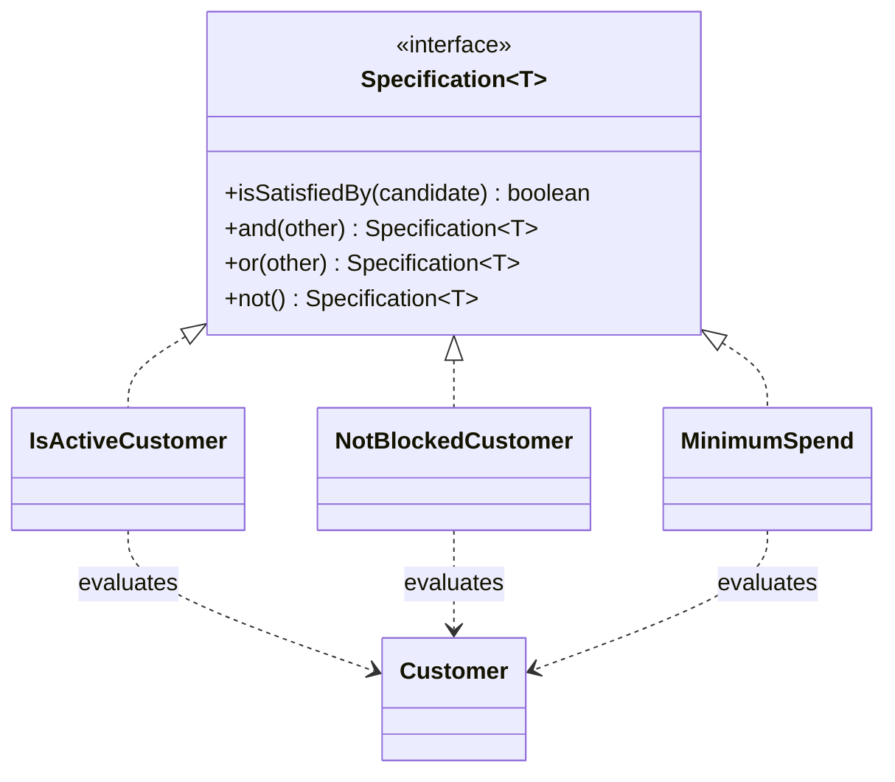

The Specification pattern is valuable when business rules need to be combined, reused, and explained without burying them inside a monolithic validator or query service.

It is not just "predicates, but with a design-pattern name."
The real benefit is giving important rules first-class names and composition boundaries.

## Quick Summary

| Question | Strong fit | Weak fit |
| --- | --- | --- |
| Are rules reused in different combinations? | yes | no, one-off logic only |
| Do business stakeholders care about rule names? | yes | no, purely local branching |
| Do rules need `and` / `or` / `not` composition? | yes | rarely |
| Is a plain method already obvious enough? | no | yes |

If a rule deserves a name, a test, and reuse, it may deserve a specification.

## Where This Pattern Helps

Typical signals:

- customer eligibility rules are assembled differently per market
- discount rules change by product, campaign, and tenant
- fraud gates combine allowlists, thresholds, and behavioral checks
- search or query filters are composed dynamically

Without a pattern, teams often end up with:

- giant `if` blocks
- services named `RuleUtils`
- repeated fragments like `isActive && !isBlocked && spend > 1000`

The code still works.
It just stops communicating the business language clearly.

## A Simple Example: Customer Eligibility

Suppose we need to determine whether a customer is eligible for a premium offer.
The rules might include:

- active account
- not blocked
- minimum annual spend
- allowed region

A named specification turns those into building blocks instead of anonymous conditions.

```java
public interface Specification<T> {
    boolean isSatisfiedBy(T candidate);

    default Specification<T> and(Specification<T> other) {
        return candidate -> this.isSatisfiedBy(candidate) && other.isSatisfiedBy(candidate);
    }

    default Specification<T> or(Specification<T> other) {
        return candidate -> this.isSatisfiedBy(candidate) || other.isSatisfiedBy(candidate);
    }

    default Specification<T> not() {
        return candidate -> !this.isSatisfiedBy(candidate);
    }
}

public record Customer(boolean active, boolean blocked, long annualSpend, String region) {}

public final class IsActiveCustomer implements Specification<Customer> {
    @Override
    public boolean isSatisfiedBy(Customer customer) {
        return customer.active();
    }
}

public final class NotBlockedCustomer implements Specification<Customer> {
    @Override
    public boolean isSatisfiedBy(Customer customer) {
        return !customer.blocked();
    }
}

public final class MinimumSpend implements Specification<Customer> {
    private final long threshold;

    public MinimumSpend(long threshold) {
        this.threshold = threshold;
    }

    @Override
    public boolean isSatisfiedBy(Customer customer) {
        return customer.annualSpend() >= threshold;
    }
}
```

Composition becomes straightforward:

```java
Specification<Customer> premiumEligibility =
        new IsActiveCustomer()
                .and(new NotBlockedCustomer())
                .and(new MinimumSpend(100_000));
```

At the UML level, the important idea is simple:
many small rule objects share one contract, and the application composes them into a larger business rule.



That reads more like domain language and less like incidental plumbing.

## Why This Can Be Better Than Plain Predicates

The gain is not syntax.
The gain is that rules become explicit design elements.

That helps when you need:

- reusable combinations
- consistent naming
- dedicated tests per rule
- translation into other forms such as query builders or policy explanations

In other words, Specification helps when rules are part of the domain model, not just inline branching.

## When Specification Becomes Too Much

This pattern gets abused when teams wrap trivial logic in classes just to feel architectural.

Bad signs:

- every tiny check becomes its own class
- nobody can tell which specifications matter to the business
- composition is harder to read than a normal method
- the code uses specifications only once

If a rule is local, short, and not reused, a simple private method is often the better choice.

> [!warning]
> Do not create a class hierarchy just to avoid writing `if`.
> Create it when the rules themselves are important and composable.

## A Common Boundary Problem: In-Memory vs Query Specifications

One subtle trap is pretending one specification model can cleanly serve every purpose.

For example:

- in-memory filtering wants Java logic
- database filtering wants query translation
- search systems want a different predicate language entirely

Teams often start with one elegant specification API and later discover it cannot translate safely everywhere.

A better rule is:
use the same *business names*, but do not force one implementation strategy across incompatible execution layers.

## Alternatives Worth Considering

### Plain methods

Best when the logic is simple and local.

### Strategy or policy objects

Better when you choose one algorithm, not compose multiple constraints.

### Rules table or external policy engine

Better when non-developers manage rules or the combinations are highly dynamic.

Specification is strongest when the rules are still code-owned, but composition has become important.

## Testing Strategy

Test specifications in two ways:

1. individual rule behavior
2. meaningful compositions

Example:

- inactive customer fails
- blocked customer fails
- high-spend active customer passes
- active customer passes only when regional rule also passes

Do not rely only on end-to-end tests.
The point of named rules is that they can be understood and verified in isolation.

## A Practical Decision Rule

Choose Specification when all of these are true:

1. rules deserve domain-level names
2. combinations vary across use cases
3. you want to test and reuse rule fragments independently

Skip it when one method with a good name already expresses the logic more clearly.

## Key Takeaways

- Specification is for composable business rules, not arbitrary condition wrapping.
- It pays off when rule naming, reuse, and combination matter.
- It gets noisy fast when the rules are trivial or purely local.
- Keep the domain vocabulary, but be careful about forcing one specification model across in-memory and database execution layers.
