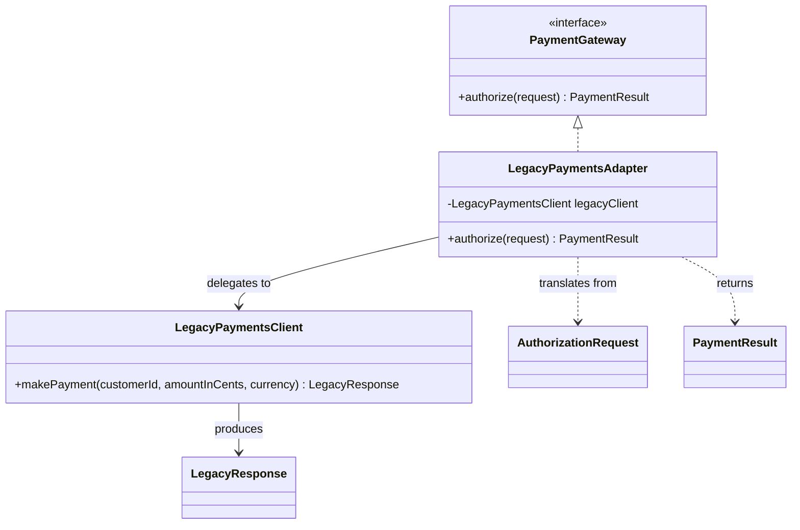

The Adapter pattern matters most during migration, not during diagramming.
It is what lets a modern boundary move forward while an old dependency remains stubbornly unchanged.

That is why the pattern is useful.
It localizes incompatibility instead of letting legacy contracts leak everywhere.

## Quick Summary

| Question | Strong fit | Weak fit |
| --- | --- | --- |
| Do two interfaces model the same capability differently? | yes | no, they represent different business concepts |
| Is one side legacy or third-party and hard to change? | yes | no, both sides are under your control |
| Do you want the rest of the codebase to speak one clean contract? | yes | no, direct integration is acceptable |
| Are you hiding semantic mismatch rather than interface mismatch? | no | yes |

Adapter solves interface mismatch well.
It does not magically erase domain mismatch.

## Migration Pressure: Old Payments, New Service Boundary

Imagine the application wants this clean interface:

```java
public interface PaymentGateway {
    PaymentResult authorize(AuthorizationRequest request);
}
```

But the old provider still exposes:

```java
public final class LegacyPaymentsClient {
    public LegacyResponse makePayment(String customerId, long amountInCents, String currency) {
        // legacy SDK call
        return new LegacyResponse("OK");
    }
}
```

Without an adapter, that old shape starts leaking into controllers, services, metrics, and tests.
Soon the migration boundary is everywhere.

With an adapter:

```java
public final class LegacyPaymentsAdapter implements PaymentGateway {
    private final LegacyPaymentsClient legacyClient;

    public LegacyPaymentsAdapter(LegacyPaymentsClient legacyClient) {
        this.legacyClient = legacyClient;
    }

    @Override
    public PaymentResult authorize(AuthorizationRequest request) {
        LegacyResponse response = legacyClient.makePayment(
                request.customerId(),
                request.amountInCents(),
                request.currency());

        return switch (response.status()) {
            case "OK" -> PaymentResult.approved();
            case "DECLINED" -> PaymentResult.declined("legacy decline");
            default -> PaymentResult.failed("legacy unknown status");
        };
    }
}
```

Now the rest of the application depends on `PaymentGateway`, not on the awkward historical API.

Structurally, this is the UML picture that matters:
the modern code talks to one clean target interface, and the adapter owns the translation to the legacy client.



## What a Good Adapter Owns

The adapter should own:

- data shape conversion
- status or error translation
- naming normalization
- legacy-specific quirks that should not leak outward

It should not become a junk drawer for unrelated orchestration logic.

If retries, metrics, fallback routing, and business decisions all pile into the adapter, the boundary becomes muddy again.

## Where Teams Misuse Adapter

### They adapt a conceptual mismatch, not an interface mismatch

If one system models "authorization" and another models "invoicing," no adapter can make those truly equivalent.
That needs a larger boundary rethink, not a clever wrapper.

### They let legacy types escape

If the adapter returns `LegacyResponse` or exposes legacy enums "just for now," the leak has already happened.

### They put migration logic everywhere

The adapter should be the compatibility choke point.
If every caller still does extra translation, the boundary failed.

### They never remove the adapter after migration

Some adapters are permanent.
Some should disappear once the old dependency is retired.
Know which kind you are building.

## Adapter vs Facade vs Anti-Corruption Layer

These patterns get confused often.

### Adapter

Use when one interface must look like another interface.

### Facade

Use when you want a simpler entry point over a subsystem.

### Anti-corruption layer

Use when two domains have meaningful conceptual differences and translation must protect one model from the other.

Adapter is narrower than an anti-corruption layer.
If the legacy system has a deeply different domain vocabulary, an adapter alone may be too small a boundary.

## Testing the Boundary

The most important adapter tests are not "method was called."
They are translation tests.

Examples:

- legacy success becomes domain success
- legacy decline maps to a stable domain result
- legacy unknown status becomes explicit failure
- legacy null or malformed fields do not leak directly outward

That test suite protects the modern interface from accidental regression whenever the legacy SDK changes.

## A Practical Decision Rule

Use Adapter when:

1. the rest of your code deserves a cleaner contract
2. the dependency being wrapped cannot be changed easily
3. the mismatch is mainly structural, naming, or protocol-oriented

Do not use it as camouflage for a deeper domain conflict.

## Key Takeaways

- Adapter is a migration boundary, not just a wrapper class.
- Its job is to stop legacy contracts from infecting the rest of the codebase.
- It works best when the mismatch is interface-level and translation is explicit.
- If the underlying concepts differ sharply, you likely need a larger integration boundary than a simple adapter.
