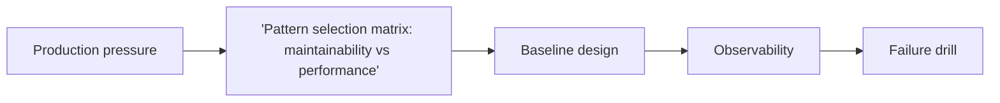

'Pattern selection matrix: maintainability vs performance' is most useful when the pattern clarifies a real design pressure instead of decorating the codebase with abstractions. The production value comes from making extension, composition, and debugging easier.

---

## Problem 1: 'Pattern selection matrix: maintainability vs performance'

Problem description:
We want 'pattern selection matrix: maintainability vs performance' to solve a specific design problem without turning the code into ceremonial abstraction. This part focuses on the baseline model and the safe default shape.

What we are solving actually:
We are establishing the core boundary, deciding what must stay explicit, and choosing a baseline that is easy to observe. For design patterns, the hidden risk is choosing abstraction because it sounds elegant instead of because it absorbs a real source of change.

What we are doing actually:

1. make the pattern assembly explicit: identify the ownership boundary and the non-negotiable invariant
2. make the pattern assembly explicit: choose the simplest baseline design that preserves correctness
3. make the pattern assembly explicit: make observability visible from the first implementation
4. make the pattern assembly explicit: validate the baseline with one concrete failure drill

---

## Why This Topic Matters

- patterns should absorb a real source of change or composition pressure
- the cost of abstraction is justified only when it simplifies evolution or debugging
- clear pattern boundaries reduce accidental responsibility overlap

---

## Architecture Model



The diagram highlights composition points and responsibility flow because 'pattern selection matrix: maintainability vs performance' only pays off when abstraction reduces debugging and change cost.
Keeping that flow visible prevents the pattern from turning into decorative indirection.

---

## Practical Design Pattern

```java
public interface TopicBehavior {
    Result execute(Command command);
}

public final class TopicResolver {
    TopicBehavior resolve(Context context) {
        // Compose the right behavior for: 'Pattern selection matrix: maintainability vs performance'
        return command -> Result.success();
    }
}
```

This pattern example is intentionally modest because 'pattern selection matrix: maintainability vs performance' should clarify one source of change before it introduces any new layers.
When the abstraction does not make responsibilities easier to follow, adding more pattern machinery rarely helps.

---

## Failure Drill

Baseline drill: add one new behavior variant and verify the pattern extension path stays clearer than editing one giant class for 'pattern selection matrix: maintainability vs performance'.

That drill matters early, before rollout assumptions harden into defaults because 'pattern selection matrix: maintainability vs performance' should prove it reduces change friction under pressure, not just that the abstraction reads nicely in isolation.

---

## Debug Steps

Debug steps:

- name the exact design pressure before choosing the pattern vocabulary while validating 'pattern selection matrix: maintainability vs performance'
- keep one place where the composition order is visible while validating 'pattern selection matrix: maintainability vs performance'
- check whether the pattern reduces change cost or merely moves it around while validating 'pattern selection matrix: maintainability vs performance'
- remove abstraction if the extension path is still harder than plain code while validating 'pattern selection matrix: maintainability vs performance'

---

## Production Checklist

- source of change that justifies the abstraction written down
- composition boundary visible in code review
- debugging path clearer after the pattern than before
- fallback simpler implementation still understood by the team

---

## Key Takeaways

- 'Pattern selection matrix: maintainability vs performance' should be designed as a production decision, not just an implementation detail
- patterns should clarify the source of change, not decorate the code
- start from a measurable baseline before optimizing
