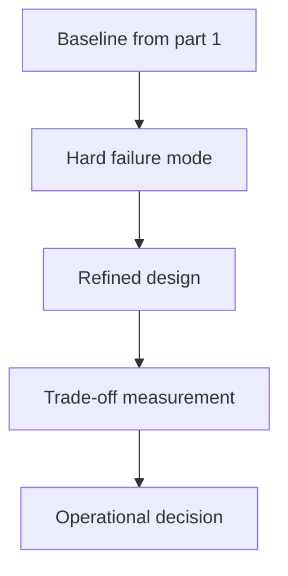

Proxy pattern for caching, resilience, and throttling wrappers (Part 2) is most useful when the pattern clarifies a real design pressure instead of decorating the codebase with abstractions. The production value comes from making extension, composition, and debugging easier.

---

## Problem 1: Proxy pattern for caching, resilience, and throttling wrappers (Part 2)

Problem description:
We want proxy pattern for caching, resilience, and throttling wrappers (part 2) to solve a specific design problem without turning the code into ceremonial abstraction. This part focuses on hardening, edge cases, and where the first design usually starts to bend.

What we are solving actually:
We are solving for operational hardening: failure semantics, trade-offs, and the places where naive implementations start leaking risk. For design patterns, the hidden risk is choosing abstraction because it sounds elegant instead of because it absorbs a real source of change.

What we are doing actually:

1. make the pattern assembly explicit: stress the baseline with the most likely failure or contention mode
2. make the pattern assembly explicit: introduce one hardening mechanism at a time
3. make the pattern assembly explicit: measure the operational trade-off instead of trusting intuition
4. make the pattern assembly explicit: document where the pattern should stop and another pattern should begin

---

## Why This Topic Matters

- patterns should absorb a real source of change or composition pressure
- the cost of abstraction is justified only when it simplifies evolution or debugging
- clear pattern boundaries reduce accidental responsibility overlap

---

## Architecture Model



The diagram highlights composition points and responsibility flow because proxy pattern for caching, resilience, and throttling wrappers (part 2) only pays off when abstraction reduces debugging and change cost.
Keeping that flow visible prevents the pattern from turning into decorative indirection.

---

## Practical Design Pattern

```java
public interface TopicBehavior {
    Result execute(Command command);
}

public final class TopicResolver {
    TopicBehavior resolve(Context context) {
        // Compose the right behavior for: Proxy pattern for caching, resilience, and throttling wrappers (Part 2)
        return command -> Result.success();
    }
}
```

This pattern example is intentionally modest because proxy pattern for caching, resilience, and throttling wrappers (part 2) should clarify one source of change before it introduces any new layers.
When the abstraction does not make responsibilities easier to follow, adding more pattern machinery rarely helps.

---

## Failure Drill

Hardening drill: add one new behavior variant and verify the pattern extension path stays clearer than editing one giant class for proxy pattern for caching, resilience, and throttling wrappers (part 2).

That drill matters while the design is being stressed by mixed versions, retries, or recovery edge cases because proxy pattern for caching, resilience, and throttling wrappers (part 2) should prove it reduces change friction under pressure, not just that the abstraction reads nicely in isolation.

---

## Debug Steps

Debug steps:

- name the exact design pressure before choosing the pattern vocabulary while validating proxy pattern for caching, resilience, and throttling wrappers (part 2)
- keep one place where the composition order is visible while validating proxy pattern for caching, resilience, and throttling wrappers (part 2)
- check whether the pattern reduces change cost or merely moves it around while validating proxy pattern for caching, resilience, and throttling wrappers (part 2)
- remove abstraction if the extension path is still harder than plain code while validating proxy pattern for caching, resilience, and throttling wrappers (part 2)

---

## Production Checklist

- second-order change still handled by the same abstraction seam
- operational or debugging trade-off measured once
- pattern boundary remains sharper than the old conditional flow
- rollback to simpler composition still feasible

---

## Key Takeaways

- Proxy pattern for caching, resilience, and throttling wrappers (Part 2) should be designed as a production decision, not just an implementation detail
- patterns should clarify the source of change, not decorate the code
- harden one failure mode at a time instead of stacking speculative complexity
