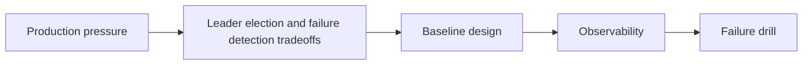

Leader election and failure detection tradeoffs is a systems trade-off, not a binary rule. Latency, ownership, failure recovery, and operator visibility all matter more than whether the pattern sounds theoretically elegant.

---

## Problem 1: Leader election and failure detection tradeoffs

Problem description:
We want leader election and failure detection tradeoffs to improve reliability and coordination without creating operational complexity we cannot observe or recover from. This part focuses on the baseline model and the safe default shape.

What we are solving actually:
We are establishing the core boundary, deciding what must stay explicit, and choosing a baseline that is easy to observe. For distributed systems, the hidden risk is that a locally correct mechanism can still fail badly once latency, partial failure, and recovery are involved.

What we are doing actually:

1. make the distributed workflow explicit: identify the ownership boundary and the non-negotiable invariant
2. make the distributed workflow explicit: choose the simplest baseline design that preserves correctness
3. make the distributed workflow explicit: make observability visible from the first implementation
4. make the distributed workflow explicit: validate the baseline with one concrete failure drill

---

## Why This Topic Matters

- correctness depends on time, retries, and partial failure, not only code structure
- operators need clear recovery rules when coordination breaks down
- latency and ownership trade-offs matter as much as algorithmic elegance

---

## Architecture Model



The model keeps ownership, latency, and recovery visible because leader election and failure detection tradeoffs is only useful when operators can still reason about it during partial failure.
A simpler picture here is a feature: it exposes the trade-off the rest of the design must honor.

---

## Practical Design Pattern

```text
Control loop for Leader election and failure detection tradeoffs:
- choose one ownership rule
- measure one correctness signal
- define one rollback gate
- avoid unbounded coordination
```

The sketch is not trying to simulate the whole system. It is there to pin down the most important control point behind leader election and failure detection tradeoffs.
Once that point is explicit, the team can add retries, leases, or replication details without losing the recovery story.

---

## Failure Drill

Baseline drill: introduce a partial failure or delay and verify the coordination rule fails safely instead of ambiguously for leader election and failure detection tradeoffs.

That drill matters early, before rollout assumptions harden into defaults because leader election and failure detection tradeoffs only earns its complexity when recovery behavior stays understandable under delay, replay, or partial failure.

---

## Debug Steps

Debug steps:

- measure the failure mode that matters before tuning the mechanism while validating leader election and failure detection tradeoffs
- check whether ownership, timeout, and replay rules are explicit while validating leader election and failure detection tradeoffs
- separate control-plane signals from data-plane success assumptions while validating leader election and failure detection tradeoffs
- test operator playbooks with synthetic drills before trusting them in production while validating leader election and failure detection tradeoffs

---

## Production Checklist

- ownership rule defined for the coordination point
- latency or correctness budget attached to the mechanism
- partial-failure recovery signal exposed to operators
- rollback move documented before the pattern spreads

---

## Key Takeaways

- Leader election and failure detection tradeoffs should be designed as a production decision, not just an implementation detail
- distributed mechanisms need recovery rules as much as steady-state logic
- start from a measurable baseline before optimizing

---

## Design Review Prompt

A useful final check for leader election and failure detection tradeoffs is whether the ownership boundary, rollback path, and main SLO signal can all be explained in three sentences. If not, the design is probably still too implicit.
