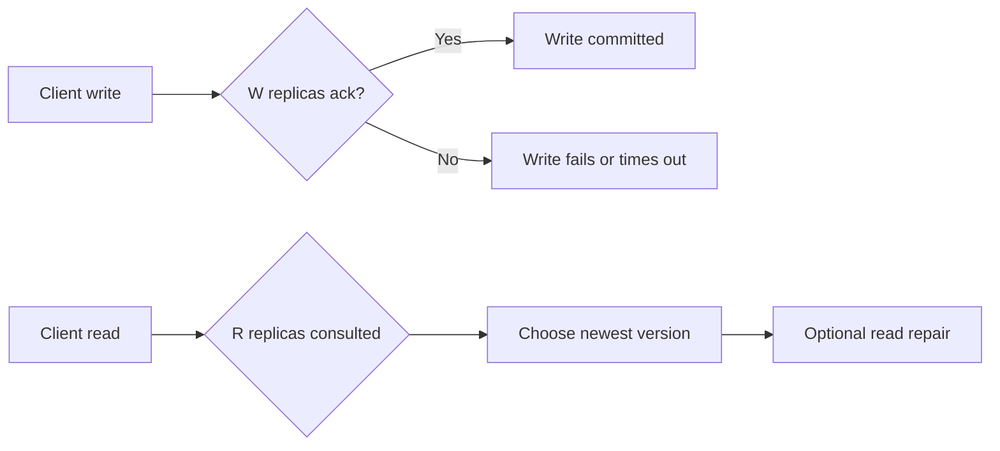

Quorum replication is attractive because it sounds like a clean bargain:
replicate data to `N` nodes, require `W` writes and `R` reads, and get a tunable balance between consistency and latency.

That summary is directionally true.
It is also incomplete enough to cause outages.

The real design question is not "should we use quorum?"
It is "what invariant must survive a partial failure, and how much latency are we willing to spend to preserve it?"

## Quick Summary

| Design question | Strong answer for quorum systems |
| --- | --- |
| What does the write path acknowledge? | durable acceptance on `W` replicas |
| What makes the read trustworthy? | a read policy that can observe the latest committed version |
| What is the hidden cost? | tail latency, cross-zone traffic, and partial-failure complexity |
| What does quorum not guarantee by itself? | linearizability, conflict-free writes, or easy operator reasoning |

The common rule of thumb is:
if `R + W > N`, read and write quorums overlap.
That overlap is useful.
It is not the whole correctness story.

## What Quorum Is Actually Buying You

Quorum replication is a way to avoid depending on every replica being alive before the system can do useful work.

Instead of saying "all replicas must answer," the design says:

- writes succeed after enough replicas confirm the new value
- reads consult enough replicas to observe the winning version
- the system tolerates some node loss without full unavailability

That trade makes sense when you care about:

- higher availability than strict all-node coordination
- durability stronger than single-leader memory state
- bounded inconsistency instead of unbounded guesswork

It does not make sense if the system still treats one hidden primary as the real source of truth while pretending the others matter equally.

## Start With the Invariant

Before picking `N`, `R`, and `W`, write down the invariant in plain language.

Examples:

- "A confirmed order must not disappear after one node loss."
- "A user should not read an older profile after receiving a success on update."
- "The system may return stale catalog data briefly, but not stale payment state."

Those statements lead to different quorum choices.
If the team cannot say which data is allowed to be stale and which is not, quorum tuning turns into superstition.

## The Three Numbers That Matter

The baseline model is:

- `N`: total replicas storing the item
- `W`: replicas that must acknowledge a write
- `R`: replicas consulted on read

Typical examples:

| `N` | `W` | `R` | What it tends to optimize |
| --- | --- | --- | --- |
| 3 | 2 | 2 | balanced safety and tolerable latency |
| 3 | 3 | 1 | stronger writes, cheaper reads |
| 3 | 1 | 3 | faster writes, heavier reads |
| 5 | 3 | 3 | stronger overlap under more failures, higher cost |

The overlap rule `R + W > N` helps because at least one replica should have seen the latest successful write.
But correctness still depends on:

- version reconciliation
- write conflict rules
- whether reads repair stale replicas
- whether acknowledgments really mean durable persistence

## Why Tail Latency Dominates the Conversation

Quorum systems are often discussed in terms of median latency.
Production pain usually arrives through the tail.

If a write must wait for 2 of 3 replicas, the end-to-end latency is not the average of those nodes.
It is shaped by the slowest replica on the critical path to quorum.

That means:

- cross-zone writes get expensive fast
- one degraded replica can hurt many requests without being fully down
- retry logic can amplify the problem instead of masking it

Quorum is often a latency *distribution* decision more than a single latency number decision.

## A Practical Mental Model

Think of quorum as two intersecting voting groups:

The system works only if "newest version" has a precise meaning.
That usually requires:

- a monotonic version number
- a timestamp policy you trust enough for this use case
- or a leader / sequencer that defines order

Without that, quorum overlap exists on paper while clients still see confusing results.

## Where Teams Get Burned

### Assuming quorum implies linearizability

It does not, automatically.
If replica coordination, clocks, or read repair are weak, a successful quorum write can still produce surprising reads.

### Treating all data classes the same

Catalog reads, user preferences, ledger entries, and workflow state do not need the same latency-consistency balance.

### Ignoring repair cost

A stale read that triggers repair may look cheap in the happy path and expensive under churn.
Operator cost matters too, not only request cost.

### Hiding multi-region distance inside one setting

`W=2` across one metro and `W=2` across continents are not the same system.

## Good Operational Questions

Ask these before rollout:

1. What percentage of traffic crosses zones or regions to meet quorum?
2. What happens when one replica is slow but not down?
3. How does the client choose the winning version on read?
4. What is the timeout policy when quorum is almost, but not quite, available?
5. Which dashboards tell operators that quorum is degrading before total failure?

If the system cannot answer those, it is not ready for production load.

## Metrics Worth Putting on the First Dashboard

At minimum, expose:

- write success rate by quorum path
- read success rate by consistency mode
- p95 and p99 latency split by local-zone vs cross-zone path
- replica divergence count or stale-read repair rate
- timeout rate when quorum is not reached
- fraction of requests served from degraded consistency mode

The most important operator question is:
"Are we still getting the quorum semantics we think we are getting?"

## When Quorum Is the Wrong Tool

Do not force quorum everywhere.

It is often a poor fit when:

- a single-writer leader model is simpler and good enough
- the business can tolerate eventual consistency with clearer reconciliation
- the data is mostly cacheable and stale reads are cheap
- latency budget is so tight that cross-replica confirmation is unacceptable

Quorum is powerful when overlap matters more than raw speed.
It is wasteful when the system does not truly need that overlap.

## Part 1 Checklist

- the data invariant is written in business language
- `N`, `R`, and `W` are tied to a failure model, not copied from a blog post
- read version selection is explicit
- latency budget includes cross-zone or cross-region behavior
- degraded mode and timeout behavior are documented
- dashboards show quorum health, not only request volume

## Key Takeaways

- Quorum is a correctness-latency trade, not a checkbox.
- `R + W > N` is useful, but it is not the whole design.
- Tail latency and repair behavior usually matter more than the clean formula.
- If the team cannot explain the invariant and the degraded mode clearly, the quorum design is still too implicit.
