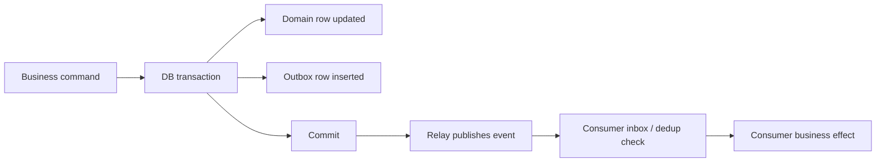

---
categories:
- Distributed Systems
- Architecture
- Backend
date: 2026-12-05
seo_title: Outbox + inbox pattern for reliable service communication - Advanced Guide
seo_description: Advanced practical guide on outbox + inbox pattern for reliable service
  communication with architecture decisions, trade-offs, and production patterns.
tags:
- distributed-systems
- architecture
- reliability
- backend
- java
title: Outbox + inbox pattern for reliable service communication
toc: true
toc_icon: cog
toc_label: In This Article
header:
  overlay_image: "/assets/images/java-advanced-generic-banner.svg"
  overlay_filter: 0.35
  show_overlay_excerpt: false
  caption: Distributed System Design Patterns and Tradeoffs
---
The outbox plus inbox pattern exists because cross-service reliability usually breaks at the boundary between "database transaction succeeded" and "message was delivered."

One side thinks the work is done.
The other side never hears about it.

Outbox and inbox do not make distributed communication magical.
They do something more practical:
they turn that broken handoff into an explicit, inspectable pipeline.

## Quick Summary

| Boundary question | Good baseline answer |
| --- | --- |
| How does the producer avoid losing an event after committing business state? | write business change and outbox record in one transaction |
| How does the consumer avoid applying the same event twice? | inbox or dedup record on the receiving side |
| What is the hidden cost? | more tables, more lag visibility, more replay operations |
| What does this pattern not give you? | global transactions or instant delivery |

The key invariant is:
if the business write commits, the integration event must become deliverable; if the event is redelivered, the consumer must not reapply the effect blindly.

## The Producer Problem Outbox Solves

Without an outbox, the producer often does this:

1. write order to database
2. publish `OrderCreated`

If step 1 succeeds and step 2 fails, the system now contains state that downstream services never learn about.

The outbox fixes that by persisting an event record inside the same transaction as the business change.



The relay can be delayed.
That is acceptable.
Losing the event silently is not.

## The Consumer Problem Inbox Solves

An outbox alone does not make the receiving side safe.
Relays retry, brokers redeliver, and replay jobs exist.

That is why the inbox or dedup side matters:

- record the received event ID
- apply the business effect in the same boundary when possible
- treat repeats as already handled

Producer safety and consumer safety are separate jobs.
Teams often implement the first and assume the second somehow comes along for free.

## A Practical Java Shape

Producer side:

```java
public final class OrderService {
    public void placeOrder(PlaceOrderCommand command) {
        transactionTemplate.executeWithoutResult(status -> {
            Order order = orderRepository.save(Order.from(command));

            outboxRepository.save(new OutboxMessage(
                    "OrderCreated",
                    order.id(),
                    "{\"orderId\":\"" + order.id() + "\"}"
            ));
        });
    }
}
```

Consumer side:

```java
public final class BillingConsumer {
    public void handle(OrderCreatedEvent event) {
        transactionTemplate.executeWithoutResult(status -> {
            boolean inserted = inboxRepository.tryInsert(event.eventId());
            if (!inserted) {
                return;
            }

            billingRepository.openInvoiceForOrder(event.orderId());
        });
    }
}
```

The point is not the repositories.
It is the transactional shape:
producer commits business state plus outbox together, consumer commits inbox plus side effect together.

## Why This Pattern Is Worth the Cost

The benefits are operational, not aesthetic:

- failed publishes become inspectable backlog instead of silent loss
- replay becomes deliberate instead of ad hoc
- consumer duplicates become expected behavior, not emergency behavior
- incident handling improves because the pipeline has durable checkpoints

You are paying extra storage and operational machinery in exchange for reliability that is visible and explainable.

## What Still Goes Wrong in Production

### Relay backlog grows quietly

The producer is "healthy" while integration lag is exploding.
If outbox age is invisible, the team learns too late.

### Ordering assumptions are implicit

The consumer expects order, but the relay or broker only guarantees eventual delivery.
Now replay fixes correctness in one place and breaks it in another.

### Payload evolution is ignored

An event sits in the outbox longer than expected, then a new consumer version reads an old shape badly.
This is an operational compatibility problem, not only a schema problem.

### Inbox retention is too short

The consumer replay happens after dedup records expired.
Now the same business effect runs again.

## Metrics That Matter Immediately

Expose these from day one:

- oldest unpublished outbox message age
- relay publish success and retry rate
- consumer inbox duplicate-hit count
- lag between producer commit time and consumer apply time
- poison-message or permanent-failure count
- replay duration and backlog drain rate

The best reliability patterns are the ones operators can see working or failing in real time.

## When Not to Use Outbox + Inbox

This pattern is strong when business state changes must reliably fan out to other services.
It is often too heavy when:

- the integration is low-value and can be recomputed from source data
- eventual omission is acceptable and periodic reconciliation is cheaper
- a single-writer log already exists and is the source of truth

Do not add outbox and inbox just because messaging exists.
Add them when the lost-handoff failure is materially expensive.

## A Practical Decision Rule

Use outbox when producer-side "commit succeeded but publish failed" is unacceptable.
Use inbox when consumer-side duplicate delivery can corrupt business state.

If both are true, use both.
If only one side is actually risky, do not pretend the full pattern is mandatory.

## Part 1 Checklist

- producer transaction writes business state and outbox together
- relay behavior, lag, and retry policy are observable
- consumer side has a dedup or inbox boundary
- replay process is documented before the first incident
- retention windows cover realistic backlog and replay timing
- schema compatibility is considered for delayed delivery

## Key Takeaways

- Outbox makes producer-side reliability explicit.
- Inbox makes consumer-side duplicate safety explicit.
- The pattern adds operational machinery, but that machinery is the point.
- If the team cannot explain replay, lag, and dedup behavior clearly, the implementation is still too implicit.
