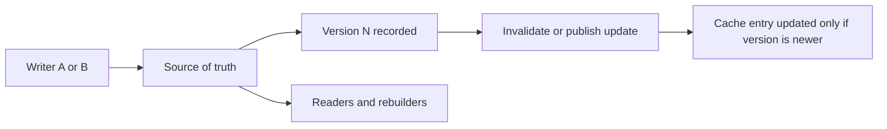

---
categories:
- Distributed Systems
- Architecture
- Backend
date: 2026-12-08
seo_title: Cache coherence patterns in multi-writer systems - Advanced Guide
seo_description: Advanced practical guide on cache coherence patterns in multi-writer
  systems with architecture decisions, trade-offs, and production patterns.
tags:
- distributed-systems
- architecture
- reliability
- backend
- java
title: Cache coherence patterns in multi-writer systems
toc: true
toc_icon: cog
toc_label: In This Article
header:
  overlay_image: "/assets/images/java-advanced-generic-banner.svg"
  overlay_filter: 0.35
  show_overlay_excerpt: false
  caption: Distributed System Design Patterns and Tradeoffs
---
Cache coherence gets genuinely difficult when more than one writer can change the same logical entity.
At that point the problem is no longer "how do we cache this row?"
It becomes "how do we stop stale data from regaining authority after a newer write already happened?"

That is a versioning and ownership problem before it is a cache library problem.

## Quick Summary

| Design choice | Strong default | Risky shortcut |
| --- | --- | --- |
| Source of truth | one authoritative store with versions | cache treated as partially authoritative |
| Write path | update source of truth first, then emit invalidation or new version | mutate cache and database independently |
| Multi-writer safety | version checks, ordering strategy, ownership boundaries | last write wins with no visibility |
| Recovery | rebuild from durable state and events | trust the cache to self-heal |
| Success metric | stale-read rate and invalidation lag | cache hit rate alone |

Part 1 is about the baseline model.
Before debating cache topology, decide how a newer value proves that it is newer.

## Why Multi-Writer Makes This Hard

With a single writer, cache coherence is already annoying.
With multiple writers, these become common:

- writes arrive out of order
- invalidation events race with cache fills
- one region or worker updates from stale state
- a slower replica repopulates an older value after a newer write

That is why "just delete the cache key on update" stops being enough.
Deletion helps only if every subsequent refill reads a sufficiently fresh source and arrives in a predictable order.

In many real systems, neither is guaranteed.

## The Baseline Principle: Versioned Authority

A strong baseline has three parts:

1. one durable source of truth
2. a monotonic version, sequence, or timestamp with real ordering meaning
3. a rule that prevents older data from overwriting newer cache state

Without version semantics, the system cannot distinguish fresh from stale.
It can only guess based on timing.



The important guarantee is not that the cache always updates instantly.
It is that once version `N+1` is known, version `N` cannot quietly reassert itself.

## Good Baseline Patterns

### Cache-aside with versioned invalidation

Update the source of truth first.
Then emit an invalidation or change event that includes the new version.

Good fit:

- read-heavy systems
- durable database already exists
- eventual consistency is acceptable

Main risk:
if readers repopulate from stale replicas, old values may return unless version checks exist.

### Write-through or write-behind with strict ownership

This works best when one service truly owns the writes and can serialize them.

Good fit:

- clear service ownership
- bounded write paths
- strong desire to keep cache freshness tight

Main risk:
teams assume this solves coherence globally, but it only helps if every writer actually goes through the same authority.

### Event-driven cache propagation

Change events broadcast new versions or invalidations to downstream caches.

Good fit:

- many read models
- cross-service consumers
- systems already operating with event streams

Main risk:
ordering, replay, and duplicate handling now become part of cache correctness.

## Dangerous Patterns to Avoid

### Delete-then-pray invalidation

The service updates the database, deletes the cache key, and assumes the next read will be correct.

This fails when:

- a stale replica is used for refill
- two writers race
- out-of-order invalidations arrive
- multiple cache layers refill differently

### Dual writes to database and cache

If the application writes both independently, partial failure creates ambiguity:

- database update succeeds, cache write fails
- cache update succeeds, database commit fails
- old writer overwrites new cache entry later

Multi-writer systems need a stronger contract than best-effort dual writes.

### Treating hit rate as the main metric

A cache can have a great hit rate and still serve dangerously stale data.
Performance success does not imply coherence success.

## Practical Versioning Rules

The exact version mechanism depends on the system:

- database sequence
- aggregate version
- log offset
- monotonically increasing event number

What matters is that the cache layer can compare freshness meaningfully.

A minimal pattern:

```java
public record VersionedValue<T>(long version, T value) {}

public final class CacheUpdater {
    public void putIfNewer(String key, VersionedValue<String> candidate) {
        cache.compute(key, (k, existing) -> {
            if (existing == null || candidate.version() > existing.version()) {
                return candidate;
            }
            return existing;
        });
    }
}
```

This does not solve global ordering by itself.
It does block one of the ugliest failure modes: stale repopulation winning by accident.

## Ownership Helps More Than Clever Invalidation

One of the best ways to reduce cache coherence pain is to reduce multi-writer freedom.

Examples:

- one service owns profile writes
- one region owns a tenant shard
- one worker owns a partition

The more writers the system allows without clear boundaries, the more coherence logic gets pushed into invalidation plumbing.
That is usually a losing trade.

## Observability That Actually Matters

Measure:

- invalidation lag
- stale-read rate
- version regression rejections
- cache refill source freshness
- out-of-order event count
- divergence between cache and source-of-truth reads

If operators only see hit rate and latency, they will miss the correctness failure until users report inconsistent behavior.

## Failure Drills Worth Running

Test these on purpose:

1. two writers update the same key in quick succession
2. invalidation arrives out of order
3. cache refill reads from a lagging replica
4. consumer replays an older event after a newer one
5. one region goes isolated and rejoins later

These are the situations where cache coherence stops being a theoretical concern and becomes a user-visible bug.

## A Practical Decision Rule

In a multi-writer system, the first question should be:
"What proves that one value is newer than another?"

If the answer is vague, the cache design is not ready.
No invalidation strategy can compensate for missing authority and version semantics.

## Part 1 Checklist

- source of truth is explicit
- version or ordering semantics are real and comparable
- stale values cannot overwrite newer ones silently
- cache refill paths are evaluated for source freshness
- ownership boundaries are tightened where possible
- metrics include stale-read and invalidation correctness, not only speed

## Key Takeaways

- Multi-writer cache coherence is mainly a versioning and ownership problem.
- Simple cache deletion is often too weak once writes can race or arrive out of order.
- A cache should never be more authoritative than the system can safely prove.
- Start with explicit freshness rules before optimizing for hit rate.
