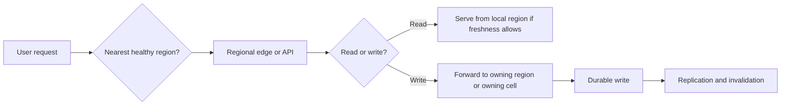

Geo-distribution sounds attractive because "serve users from the nearest region" is easy to explain.
The harder question is what happens when locality, consistency, and failover pull in different directions.

That is why locality-aware routing is not just a latency optimization.
It is an ownership decision with failure consequences.

## Quick Summary

| Question | Strong default | Dangerous shortcut |
| --- | --- | --- |
| Why use geo-routing? | reduce latency, respect data residency, contain blast radius | "multi-region sounds more reliable" |
| Request ownership | define a home region or cell for writes | let any region write anything |
| Fallback behavior | explicit degraded mode or reroute policy | implicit cross-region retry storms |
| Dependency model | identify which services are truly local vs global | assume only the frontend needs to be geo-aware |
| Success metric | tail latency plus failover correctness | median latency only |

Part 1 is about the baseline routing model.
Before global replication strategies get fancy, the team needs a simple answer to one question:
which region is allowed to serve which kind of request under normal and degraded conditions?

## When Geo-Distribution Is Worth the Cost

Geo-distribution earns its complexity when at least one of these is true:

- users are far enough apart that cross-region round trips hurt tail latency
- regulations require data residency or regional isolation
- the business cannot afford one regional failure taking down the full product
- the system is already decomposed into cells or regional shards

It is often not worth it when:

- the main latency is inside the database or application layer, not network distance
- all important writes still depend on one central region
- failover is mostly aspirational and has never been drilled
- the team cannot operate one region cleanly yet

Two mediocre regions plus unclear routing can be worse than one well-run region.

## Locality-Aware Routing Starts With Ownership

The core mistake is treating locality as a traffic manager feature instead of a data ownership rule.
If request routing says "send the user to the nearest region" but data ownership says "writes really belong to us-east-1," the system has not solved latency.
It has hidden cross-region hops.

Start by classifying traffic:

- latency-sensitive reads
- writes that require strong ownership
- background jobs and reconciliation
- control-plane traffic such as routing updates and health signals

The routing plan should not be the same for all four.

## A Safe Baseline Topology

For many teams, the safest early model is:

- route users to the nearest healthy region
- keep a home region or cell for write ownership
- serve reads locally where data freshness rules allow it
- make failover explicit instead of magical

This model may look less glamorous than full active-active everywhere.
That is the point.
It makes the routing contract legible before the team spends months debugging invisible cross-region coupling.

## Decision Rules That Matter More Than the Router Brand

### 1. Define the ownership key

Pick the thing that decides the home region:

- tenant
- account
- customer shard
- document namespace

Without a stable ownership key, locality-aware routing becomes probabilistic.

### 2. Decide whether failover is fail-open or fail-closed

When a region is unhealthy, do you:

- reject writes that cannot be served safely?
- reroute writes to a backup owner?
- allow stale reads but block mutating operations?

Every option is valid in some systems.
The bad option is pretending the answer does not matter.

### 3. Separate user-plane from control-plane thinking

A region can still answer health checks while the replication backlog, stale routing table, or overloaded dependency makes it unsafe for writes.
Routing based only on shallow liveness signals causes some of the ugliest failover incidents.

## What Usually Breaks First

The hardest incidents in geo-distributed systems usually come from hidden non-local dependencies:

- sessions stored in one region only
- rate limiting backed by a central datastore
- cache invalidation bus shared globally
- identity or payments path still dependent on the primary region
- analytics or feature-flag lookups adding cross-region latency to every request

This is why a "regional" service must be evaluated together with its dependencies.
A locally routed frontend attached to globally coupled backends is still globally fragile.

## Latency Wins Can Hide Reliability Debt

A common anti-pattern is optimizing routing for median latency and ignoring what happens at the tail:

- TCP connections still pinned to a degraded region
- retries jumping across regions with no budget
- stale locality maps causing traffic to oscillate
- clients seeing region-specific partial data

The interesting question is not "did the fastest request get faster?"
It is "did the slowest important request become more predictable during failure?"

That is the standard operators actually care about.

## Observability You Need Before Claiming Multi-Region Success

At minimum, measure:

- request latency by serving region and owning region
- percentage of cross-region hops
- failover decision count
- replication lag by region pair
- stale-read tolerance breaches
- success rate during degraded routing modes

Also log the routing reason.
During incidents, "request served by eu-west because us-east was unhealthy" is far more useful than a generic region tag.

## Failure Drills Worth Running

Before calling the architecture ready, rehearse these:

1. regional dependency slowdown without full outage
2. stale routing map pushing traffic to the wrong region
3. write ownership handoff for one tenant or shard
4. local read path while replication is behind
5. recovery after failback, not just failover

Teams often practice the dramatic outage and ignore the more common degraded-state incident.
In reality, long partial failures cause more operational pain than total blackouts.

## A Practical Decision Rule

Locality-aware routing is pulling its weight when:

- the serving region is usually close to the user
- the owning region is predictable
- fallback behavior is explicit
- cross-region dependencies are visible and bounded
- failover does not create ambiguous write ownership

If those are not true, the architecture is probably absorbing cost without delivering reliable locality.

## Part 1 Checklist

- home-region or ownership rule is explicit
- request classes have distinct routing policies
- degraded-mode behavior is defined for reads and writes
- hidden cross-region dependencies are documented
- metrics expose serving region, owning region, and cross-region hop rate
- failover drills include stale state and recovery, not only black-hole outages

## Key Takeaways

- Geo-routing is an ownership strategy before it is a networking trick.
- The system should optimize for understandable failover, not only low median latency.
- If every region can write everything without strong coordination rules, incidents will turn into ambiguity fast.
- Start with a routing model the operators can explain under pressure.
