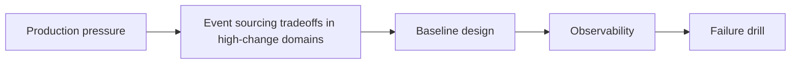

Event sourcing tradeoffs in high-change domains is a systems trade-off, not a binary rule. Latency, ownership, failure recovery, and operator visibility all matter more than whether the pattern sounds theoretically elegant.

---

## Problem 1: Event sourcing tradeoffs in high-change domains

Problem description:
We want event sourcing tradeoffs in high-change domains to improve reliability and coordination without creating operational complexity we cannot observe or recover from. This part focuses on the baseline model and the safe default shape.

What we are solving actually:
We are establishing the core boundary, deciding what must stay explicit, and choosing a baseline that is easy to observe. For distributed systems, the hidden risk is that a locally correct mechanism can still fail badly once latency, partial failure, and recovery are involved.

What we are doing actually:

1. make the distributed workflow explicit: identify the ownership boundary and the non-negotiable invariant
2. make the distributed workflow explicit: choose the simplest baseline design that preserves correctness
3. make the distributed workflow explicit: make observability visible from the first implementation
4. make the distributed workflow explicit: validate the baseline with one concrete failure drill

---

## Why This Topic Matters

- correctness depends on time, retries, and partial failure, not only code structure
- operators need clear recovery rules when coordination breaks down
- latency and ownership trade-offs matter as much as algorithmic elegance

---

## Architecture Model



The model keeps ownership, latency, and recovery visible because event sourcing tradeoffs in high-change domains is only useful when operators can still reason about it during partial failure.
A simpler picture here is a feature: it exposes the trade-off the rest of the design must honor.

---

## Practical Design Pattern

```text
Control loop for Event sourcing tradeoffs in high-change domains:
- choose one ownership rule
- measure one correctness signal
- define one rollback gate
- avoid unbounded coordination
```

The sketch is not trying to simulate the whole system. It is there to pin down the most important control point behind event sourcing tradeoffs in high-change domains.
Once that point is explicit, the team can add retries, leases, or replication details without losing the recovery story.

---

## Failure Drill

Baseline drill: introduce a partial failure or delay and verify the coordination rule fails safely instead of ambiguously for event sourcing tradeoffs in high-change domains.

That drill matters early, before rollout assumptions harden into defaults because event sourcing tradeoffs in high-change domains only earns its complexity when recovery behavior stays understandable under delay, replay, or partial failure.

---

## Debug Steps

Debug steps:

- measure the failure mode that matters before tuning the mechanism while validating event sourcing tradeoffs in high-change domains
- check whether ownership, timeout, and replay rules are explicit while validating event sourcing tradeoffs in high-change domains
- separate control-plane signals from data-plane success assumptions while validating event sourcing tradeoffs in high-change domains
- test operator playbooks with synthetic drills before trusting them in production while validating event sourcing tradeoffs in high-change domains

---

## Production Checklist

- ownership rule defined for the coordination point
- latency or correctness budget attached to the mechanism
- partial-failure recovery signal exposed to operators
- rollback move documented before the pattern spreads

---

## Key Takeaways

- Event sourcing tradeoffs in high-change domains should be designed as a production decision, not just an implementation detail
- distributed mechanisms need recovery rules as much as steady-state logic
- start from a measurable baseline before optimizing
