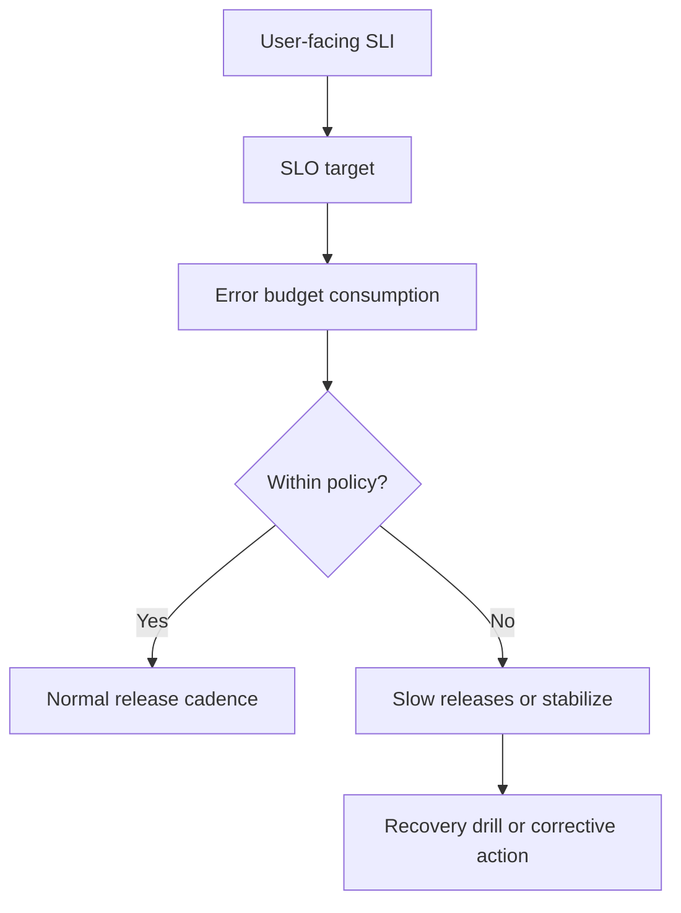

---
categories:
- Distributed Systems
- Architecture
- Backend
date: 2026-12-12
seo_title: 'Reliability playbook: SLOs, error budgets, and recovery drills - Advanced
  Guide'
seo_description: 'Advanced practical guide on reliability playbook: slos, error budgets,
  and recovery drills with architecture decisions, trade-offs, and production patterns.'
tags:
- distributed-systems
- architecture
- reliability
- backend
- java
title: 'Reliability playbook: SLOs, error budgets, and recovery drills'
toc: true
toc_icon: cog
toc_label: In This Article
header:
  overlay_image: "/assets/images/java-advanced-generic-banner.svg"
  overlay_filter: 0.35
  show_overlay_excerpt: false
  caption: Distributed System Design Patterns and Tradeoffs
---
Reliability work becomes wasteful when it is all aspiration and no operating rule.

Teams say they care about uptime, but they have no agreed service level objective.
They talk about quality, but nobody knows when feature work should stop and reliability work should start.
They run incidents, but they do not practice recovery before the incident happens.

That is why the real reliability playbook is not a dashboard.
It is a set of decisions the organization agrees to honor under pressure.

## Quick Summary

| Component | Real purpose |
| --- | --- |
| SLO | defines what good service means for users |
| error budget | defines how much unreliability is still acceptable |
| recovery drill | proves the team can restore service, not just discuss it |
| policy response | connects reliability signals to engineering action |

The important invariant is:
if the system is consuming too much reliability budget, the team must change behavior, not just update slides.

## Start With One User-Facing SLI

The fastest way to make an SLO useless is to measure something convenient but indirect.

Good starting signals are usually user-visible:

- successful request ratio
- p95 latency for a critical endpoint
- job completion success for a batch workflow
- event processing delay for a customer-visible pipeline

Weak starting signals are usually internal-only:

- CPU usage
- queue depth by itself
- pod count
- number of alerts fired

Those internal signals matter for diagnosis.
They usually do not define service quality on their own.

## A Good SLO Is Specific Enough to Drive Action

Example:

| Service | SLI | SLO |
| --- | --- | --- |
| Checkout API | successful checkout completion | 99.9% over 30 days |
| Payment authorization | successful authorization within 2 seconds | 99.5% over 30 days |
| Event ingestion | events visible to consumers within 60 seconds | 99% over 7 days |

The value of an SLO is not that it sounds mature.
The value is that when the number degrades, everyone knows whether the system is still inside the acceptable boundary.

## Error Budget Is the Policy Lever

If a 99.9% availability target exists over 30 days, the system has a finite amount of permitted failure.
That allowance is the error budget.

The budget matters because it turns reliability from an emotional debate into a controlled trade.

For example:

- healthy budget remaining -> normal release pace
- budget burning faster than expected -> tighten release and change management
- budget exhausted -> stop risky changes and prioritize stabilization

Without that policy response, SLOs become reporting theater.

## Recovery Drills Are Where the Playbook Becomes Real

A dashboard can tell you the service is red.
A drill tells you whether the team can actually recover it.

Run drills for events like:

- one dependency timing out hard
- one zone becoming unavailable
- queue backlog growth during partial consumer failure
- bad release rollback under peak traffic

The drill is not a bonus activity.
It is how the team proves the policy survives contact with reality.

## The Playbook Should Answer Four Questions

Every serious service should have explicit answers to these:

1. What user promise are we measuring?
2. What budget remains, and over what window?
3. What engineering behavior changes when the budget is burning?
4. What recovery steps have we actually practiced?

If one of those answers is vague, reliability work is probably still personality-driven rather than system-driven.

## Common Failure Modes

### Too many SLOs

Teams create dozens of objectives and then ignore the ones that matter most.
Start with a small number tied to critical user journeys.

### SLOs that track internals, not outcomes

The service looks green while users are failing.

### Error budget with no consequence

The team blows the budget and keeps releasing at the same pace.
That means the budget is informational, not operational.

### Drills that are too artificial

If the exercise avoids the real dependency graph, real dashboards, and real on-call path, it is closer to training theater than operational proof.

## A Better Review Rhythm

Use a monthly or biweekly loop:

- review SLO attainment
- inspect error budget burn rate
- identify one top reliability risk
- decide whether feature pace or operational posture should change
- schedule one drill or one hardening task

This is more effective than collecting dozens of disconnected action items after every incident.

## What Good Reliability Maturity Looks Like

You know the system is improving when:

- product and engineering understand the same reliability numbers
- on-call can explain current budget state quickly
- recovery steps are practiced, not just documented
- rollback and mitigation decisions are connected to budget policy
- incident reviews change either architecture or operational rules

Reliability maturity is not "we have better charts."
It is "we make better decisions under failure."

## When Teams Over-Engineer This

Do not start with a giant reliability governance program for a small service with one critical endpoint.

Start with:

- one SLI
- one SLO
- one error budget policy
- one realistic drill

That small loop is already much better than a complicated framework nobody can operate.

## Part 1 Checklist

- at least one user-visible SLI is defined
- SLO target and evaluation window are explicit
- error budget burn changes engineering behavior
- one realistic recovery drill is scheduled and documented
- dashboards separate user outcome from infrastructure detail
- incident review feeds the playbook, not only a wiki page

## Key Takeaways

- SLOs define the promise.
- Error budgets define the response when reliability degrades.
- Recovery drills prove the response is real.
- A reliability playbook is only useful when it changes decisions under pressure.
