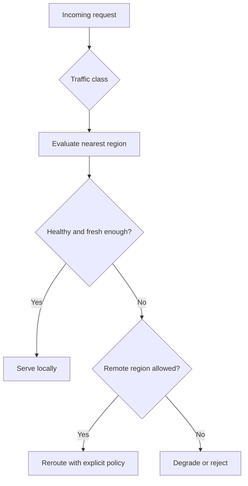

Part 1 is usually where teams decide they want locality-aware routing.
Part 2 is where they discover that "send traffic to the nearest healthy place" hides most of the hard questions.

Which region is allowed to serve stale reads?
What happens when a region is healthy enough to receive traffic but too stale to answer safely?
Who decides when locality loses to correctness?

That is the real hardening problem.

## Quick Summary

| Decision | Safer default |
| --- | --- |
| nearest region is fast but behind | route only requests that can tolerate staleness |
| nearest region is overloaded | shed or reroute with explicit policy, not hidden retries |
| failover target is farther away | prefer correctness over vanity locality metrics |
| region health is ambiguous | degrade deliberately instead of serving from a half-valid state |

Part 2 is about making those fallback and routing rules explicit before production traffic makes them implicit for you.

## What Actually Breaks After the Happy Path

Locality-aware routing sounds straightforward in diagrams:

- keep traffic close to users
- avoid long-haul latency
- fail over when a region degrades

But real systems fail in uneven ways.

Examples:

- the nearest region is reachable but its replica lag is too high
- DNS or traffic manager health checks say a region is up while application correctness is already compromised
- one region can still serve reads but should stop taking writes
- failover creates a cross-region dependency spike that becomes the next outage

The routing layer is not just choosing the shortest path.
It is enforcing a correctness policy under partial failure.

## Locality Is a Policy, Not a Law of Physics

The most expensive mistake is treating geography as the primary rule.
The primary rule should be the data or workflow invariant.

Examples:

- product catalog browsing can usually tolerate more staleness than account balance reads
- idempotent event ingestion can tolerate rerouting better than a latency-sensitive checkout confirmation
- a session-affine workflow may prefer stickiness over strict nearest-region routing

That means a good geo-routing design usually needs request classes such as:

- local if healthy and fresh enough
- local for reads, remote for writes
- local only for cached or derived data
- fail closed when the correctness boundary is unclear

If every request uses the same routing rule, the system is probably flattening meaningful business differences.

## The Key Hardening Question

For each traffic class, ask:

1. what correctness guarantee is required?
2. what freshness or replication condition makes a region eligible?
3. what fallback is allowed when the local region fails that condition?
4. who owns the decision to reroute, degrade, or reject?

That is the conversation that turns routing from networking trivia into architecture.

## A Practical Routing Model

The important phrase there is "fresh enough."
Pure health is not the same thing as correctness eligibility.

## Where Routing Decisions Usually Belong

Different responsibilities often get mixed together:

- edge routing
- region health evaluation
- replica freshness evaluation
- application degrade policy

Do not stuff all of that into one traffic manager rule set.

A more realistic split is:

- edge decides candidate region set
- platform health system decides whether a region is routable
- application or data plane decides whether the request can be served safely there

That separation prevents the load balancer from pretending it understands business correctness.

## Real Failure Modes to Design Around

### Healthy-but-stale region

Infrastructure checks pass.
The region responds quickly.
But replication lag means some requests should not be served there.

If routing ignores freshness, the system returns fast but wrong answers.

### Failover stampede

One region degrades, so traffic shifts to a second region.
That region becomes the new bottleneck because caches are cold, dependencies are cross-region, or quotas were sized only for steady state.

Failover without capacity math is just delayed failure.

### Split control-plane and data-plane truth

DNS, service discovery, or global load balancing may say a region is eligible while application leaders, replicas, or message processors disagree.

If those signals are not reconciled, operators end up debugging two different realities.

### Sticky sessions hiding regional damage

Session affinity can reduce flapping, but it can also keep users pinned to a degraded region longer than they should be.

Affinity is a tradeoff, not a free optimization.

## Metrics That Matter More Than "Nearest Served"

At minimum, watch:

- local-serve rate by traffic class
- reroute rate by reason
- request latency after reroute
- replica lag or freshness eligibility failures
- fail-closed response count
- regional saturation during failover

The key operational question is not just "did failover happen?"
It is "did we fail over into a region that was actually safe for this request type?"

## A Failure Drill Worth Running

Simulate a region that is:

- reachable
- partially healthy
- behind on replication

Then verify:

- which request classes still serve locally
- which reroute remotely
- which fail closed
- whether dashboards explain those decisions clearly

If operators cannot explain why one request type rerouted and another was rejected, the policy is not explicit enough.

## When to Prefer Degradation Over Rerouting

Rerouting is often treated as the heroic default.
It should not be.

Sometimes the better option is:

- serve cached data with a stale banner
- disable a write path temporarily
- reject a high-risk operation instead of running it against uncertain state

That may look harsher from the outside.
It is usually kinder than silent correctness drift.

## Practical Decision Rule

Use locality-aware routing only after defining:

1. request classes
2. freshness requirements
3. remote-serve eligibility
4. explicit degrade behavior
5. operator-visible reasons for each decision

If the design still says "nearest healthy region wins," it is not hardened yet.

## Key Takeaways

- In geo-distributed systems, health and correctness are related but different checks.
- Locality-aware routing should be driven by request class and freshness policy, not geography alone.
- The hard problem is deciding when locality is allowed to lose to correctness.
- Explicit degrade behavior is often safer than automatic reroute optimism.
