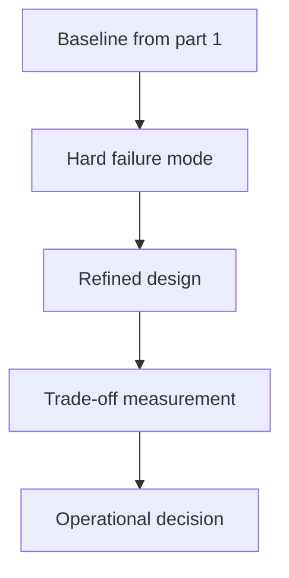

Causality and ordering with logical/vector clocks (Part 2) is a systems trade-off, not a binary rule. Latency, ownership, failure recovery, and operator visibility all matter more than whether the pattern sounds theoretically elegant.

---

## Problem 1: Causality and ordering with logical/vector clocks (Part 2)

Problem description:
We want causality and ordering with logical/vector clocks (part 2) to improve reliability and coordination without creating operational complexity we cannot observe or recover from. This part focuses on hardening, edge cases, and where the first design usually starts to bend.

What we are solving actually:
We are solving for operational hardening: failure semantics, trade-offs, and the places where naive implementations start leaking risk. For distributed systems, the hidden risk is that a locally correct mechanism can still fail badly once latency, partial failure, and recovery are involved.

What we are doing actually:

1. make the distributed workflow explicit: stress the baseline with the most likely failure or contention mode
2. make the distributed workflow explicit: introduce one hardening mechanism at a time
3. make the distributed workflow explicit: measure the operational trade-off instead of trusting intuition
4. make the distributed workflow explicit: document where the pattern should stop and another pattern should begin

---

## Why This Topic Matters

- correctness depends on time, retries, and partial failure, not only code structure
- operators need clear recovery rules when coordination breaks down
- latency and ownership trade-offs matter as much as algorithmic elegance

---

## Architecture Model



The model keeps ownership, latency, and recovery visible because causality and ordering with logical/vector clocks (part 2) is only useful when operators can still reason about it during partial failure.
A simpler picture here is a feature: it exposes the trade-off the rest of the design must honor.

---

## Practical Design Pattern

```text
Control loop for Causality and ordering with logical/vector clocks (Part 2):
- choose one ownership rule
- measure one correctness signal
- define one rollback gate
- avoid unbounded coordination
```

The sketch is not trying to simulate the whole system. It is there to pin down the most important control point behind causality and ordering with logical/vector clocks (part 2).
Once that point is explicit, the team can add retries, leases, or replication details without losing the recovery story.

---

## Failure Drill

Hardening drill: introduce a partial failure or delay and verify the coordination rule fails safely instead of ambiguously for causality and ordering with logical/vector clocks (part 2).

That drill matters while the design is being stressed by mixed versions, retries, or recovery edge cases because causality and ordering with logical/vector clocks (part 2) only earns its complexity when recovery behavior stays understandable under delay, replay, or partial failure.

---

## Debug Steps

Debug steps:

- measure the failure mode that matters before tuning the mechanism while validating causality and ordering with logical/vector clocks (part 2)
- check whether ownership, timeout, and replay rules are explicit while validating causality and ordering with logical/vector clocks (part 2)
- separate control-plane signals from data-plane success assumptions while validating causality and ordering with logical/vector clocks (part 2)
- test operator playbooks with synthetic drills before trusting them in production while validating causality and ordering with logical/vector clocks (part 2)

---

## Production Checklist

- replay, retry, or failover edge case exercised explicitly
- consistency trade-off described in operational language
- recovery signal visible before the next hardening step
- rollback checkpoint recorded with timing expectations

---

## Key Takeaways

- Causality and ordering with logical/vector clocks (Part 2) should be designed as a production decision, not just an implementation detail
- distributed mechanisms need recovery rules as much as steady-state logic
- harden one failure mode at a time instead of stacking speculative complexity
