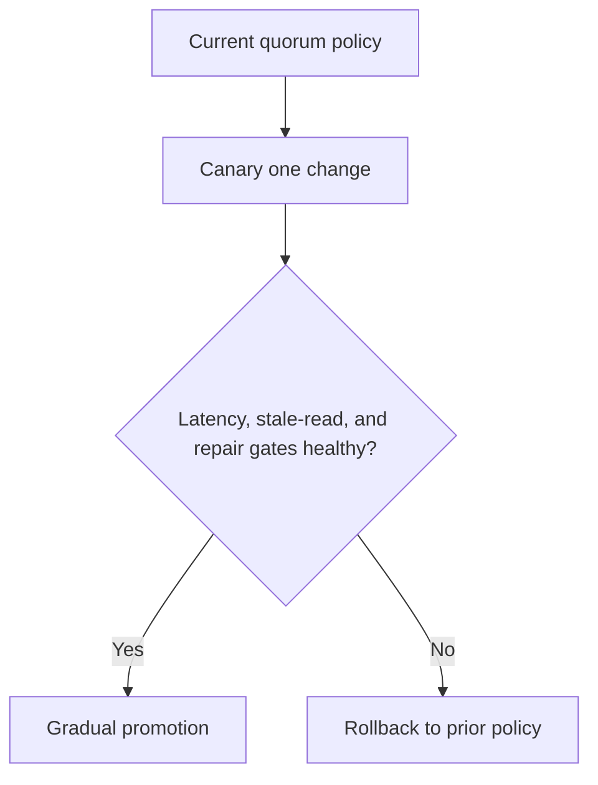

---
categories:
- Distributed Systems
- Architecture
- Backend
date: 2026-12-27
seo_title: Quorum replication and consistency-latency balancing (Part 3) - Advanced
  Guide
seo_description: Advanced practical guide on quorum replication and consistency-latency
  balancing (part 3) with architecture decisions, trade-offs, and production patterns.
tags:
- distributed-systems
- architecture
- reliability
- backend
- java
title: Quorum replication and consistency-latency balancing (Part 3)
toc: true
toc_icon: cog
toc_label: In This Article
header:
  overlay_image: "/assets/images/java-advanced-generic-banner.svg"
  overlay_filter: 0.35
  show_overlay_excerpt: false
  caption: Distributed System Design Patterns and Tradeoffs
---
Part 3 is where quorum systems stop being math and start being operational law.
By now the team usually understands `N`, `R`, `W`, overlap, and the basic consistency-latency tradeoff.
What still causes production incidents is not the formula itself.
It is unsafe change management around the formula.

The hard question is not "does `R + W > N` overlap?"
It is "how do we change quorum behavior, membership, and read/write policy without creating ambiguous success paths during partial failure?"

## Quick Summary

| Operational question | Safer default |
| --- | --- |
| changing quorum numbers | do not change membership and quorum thresholds in the same rollout |
| promoting a new read policy | shadow first, then canary under real tail-latency conditions |
| operator success signal | track stale-read rate, write latency, and repair backlog together |
| degraded replica handling | prefer explicit fail/partial service rules over silent ambiguity |
| rollback design | define which configuration is authoritative before rollout begins |

Quorum systems are easy to discuss in diagrams and easy to damage with sloppy rollout order.

## What Part 3 Is Really Solving

Part 1 establishes the model.
Part 2 usually deals with hard cases such as repair, failure, and reconciliation.
Part 3 is about keeping the system healthy after day one.

That means deciding:

- who is allowed to change `R`, `W`, or placement policy
- how new replicas are introduced safely
- when stale-read risk is acceptable
- what metrics must block promotion
- how operators distinguish "slow quorum" from "broken quorum"

If those rules are not written down, the quorum design is unfinished no matter how elegant the original architecture looked.

## Start With the Non-Negotiable Invariant

Before rollout policy, state the invariant in plain language.

Examples:

- a user must not observe an older profile after a successful write acknowledgement
- an order commit must survive one replica loss
- stale catalog reads are acceptable for a few seconds, stale payment state is not

That statement determines whether a rollout is safe.
Without it, teams end up tuning quorum values based on average latency or intuition rather than correctness requirements.

## The Most Dangerous Rollout Mistake

Do not change too many of these at once:

- replica membership
- quorum thresholds
- read winner selection logic
- repair policy
- timeout policy

If two or three of those change in the same release, operators lose the ability to explain which assumption broke.
Quorum systems punish that loss of clarity hard.

A safer sequence is:

1. add observability first
2. canary one read or write path change
3. verify tail behavior and stale-read behavior
4. promote gradually
5. only then consider the next control-plane change

## Tail Latency Is a Promotion Gate, Not a Side Metric

Quorum designs often look healthy in median latency and unhealthy in the tail.
That is because quorum success depends on enough replicas responding, not on average node behavior.

If one zone becomes slow but not fully down:

- writes may still succeed, but much slower
- retries may amplify cross-zone load
- reads may hit reconciliation or repair paths more often
- clients may see inconsistent response shapes before they see outright failure

That is why promotion gates should include:

- p95 and p99 write latency
- replica response distribution
- read repair count
- stale-read or version-mismatch rate

A quorum rollout judged only by success rate is under-measured.

## A Better Rollout Shape

The important phrase there is "one change."
Quorum systems become hard to reason about when membership, repair, and timeout changes arrive as one bundle.

## What Operators Need to Know During Degraded Mode

The runbook should answer these questions explicitly:

1. what counts as a successful write acknowledgement right now?
2. which replica set is considered authoritative for version choice?
3. when should traffic be reduced or shifted instead of retried?
4. when is repair backlog acceptable versus incident-worthy?
5. what rollback restores the previous guarantee fastest?

If the answer to any of those is "look at the source code," the operator model is too weak.

## Common Failure Modes

### Overlap exists, but read winner selection is vague

`R + W > N` helps only if the system has a trustworthy rule for newest version selection.
Without that, overlap exists theoretically while clients still see confusing results.

### Cross-region quorum enabled without explicit latency ownership

A cross-region quorum is not just a bigger cluster.
It is a different operational contract with different tail behavior.

### Repair work treated as background trivia

Repair is part of the steady-state design, not just housekeeping.
Backlog growth is often an early warning for a coming correctness problem.

### Ambiguous success on timeout boundaries

Operators need to know whether a timed-out write may still have committed on a quorum subset.
That answer changes retry safety completely.

## Metrics Worth Putting on the First Dashboard

At minimum, expose:

- write latency by quorum path
- replica lag or divergence indicators
- stale-read or version conflict rate
- read repair count and backlog
- timeout count split by read and write paths
- cross-zone or cross-region quorum path frequency

The dashboard should let an operator say:
"We are healthy but slower," or "we are serving ambiguous correctness," not just "some requests are timing out."

## A Practical Governance Rule

Treat quorum configuration as correctness policy, not simple tuning.
That means:

- change review by people who understand the invariant
- promotion gates that include correctness-adjacent signals
- rollback instructions that restore a known prior guarantee
- failure drills that simulate slow replicas, not only dead replicas

Quorum systems become supportable when the operational contract is as explicit as the replication algorithm.

## Key Takeaways

- Quorum math is only the beginning; rollout policy determines whether the design survives production.
- Tail latency, stale-read risk, and repair backlog should all gate promotion.
- Do not change membership, quorum thresholds, and reconciliation logic together.
- Operators need an explicit answer for what "successful" means under degraded conditions.
