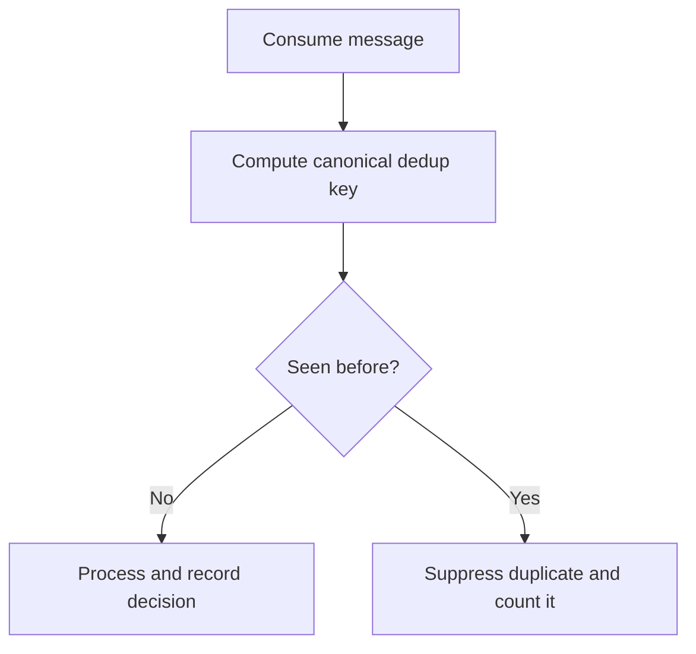

Part 3 is about the uncomfortable truth behind idempotent consumers:
the algorithm is usually not what breaks first.
The operational contract does.

Teams say "the consumer is idempotent" and then discover that:

- the dedup key changed format
- the retention window was too short
- replay traffic bypassed the normal path
- a side effect happened before the dedup write

At that point the problem is no longer theoretical messaging semantics.
It is production governance around duplicates, replays, and handoff boundaries.

## Quick Summary

| Operational question | Safer default |
| --- | --- |
| dedup key definition | keep it stable, explicit, and versioned |
| dedup store retention | size it to replay reality, not wishful average delay |
| replay or backfill | run through the same dedup contract unless you deliberately declare a different one |
| side-effect ordering | claim or verify dedup state before external effects where possible |
| operator model | track duplicate rate, rejected duplicates, and dedup-store failures separately |

The key insight is simple:
idempotency is not a property of code alone.
It is a property of the whole consumer contract.

## What Part 3 Is Really Solving

Part 1 usually explains the pattern.
Part 2 usually hardens failure and storage behavior.
Part 3 asks:
how do we roll this out, evolve it, and operate it safely over time?

That means deciding:

- which message field is the canonical dedup key
- how long a key remains valid
- what happens during replays or dead-letter reprocessing
- what the system does when the dedup store is unavailable
- how operators distinguish duplicate suppression from data loss

Without those answers, "idempotent consumer" is just hopeful language.

## Start With the Dedup Contract

Write down the contract in plain language:

1. what uniquely identifies one logical operation?
2. for how long must duplicates be recognized?
3. what side effects are protected by the dedup decision?
4. what happens when the dedup store cannot be consulted?

Those four answers matter more than the specific database or cache chosen for the dedup table.

If the team cannot answer them, replay safety is undefined no matter how polished the code looks.

## The Most Common Production Failure

The most common failure is not "we forgot to check the dedup key."
It is subtler:
the dedup key is unstable across producers, retries, or schema versions.

Examples:

- a retry path generates a new request ID
- an upstream service changes event shape without preserving logical identity
- backfill tooling republishes data with fresh envelope IDs

At that point the consumer still looks idempotent in local tests, while production duplicates slip straight through.

## A Safer Rollout Pattern

Before enforcing dedup as a hard gate, start by observing it.

In early rollout, that means:

1. compute the key
2. log or count would-be duplicates
3. verify the key is stable across retries and replay tools
4. only then enforce suppression

This avoids a nasty trap:
turning on enforcement before proving the key truly represents logical identity.

## Side-Effect Ordering Is the Real Boundary

If the external effect happens before the dedup claim is durable, you are not really protected.

That is why teams need an explicit answer for this question:
what is the first irreversible side effect in the flow?

If the flow is:

1. call external payment provider
2. then write dedup record

you may still double-charge on retry even though the code contains "dedup logic."

The safer model is to make the dedup decision part of the state transition that authorizes the effect, or to ensure the downstream side effect is itself idempotent.

## Replays and Backfills Need Their Own Rules

Many systems work fine under normal streaming load and fail during replay.
That is because replay creates different pressure:

- higher duplicate density
- older messages beyond normal retention
- tooling paths that bypass production consumers

Operators need a written rule for replay jobs:

- use normal dedup rules
- extend retention temporarily
- or deliberately run under a different reconciliation mode

What you must not do is let replay semantics remain implicit.

## What to Do When the Dedup Store Is Unavailable

This is a policy decision, not a code accident.

You generally have three choices:

1. fail closed: stop processing if dedup cannot be checked
2. fail open: continue and accept duplicate risk
3. degrade selectively: fail closed for high-risk operations, fail open for low-risk ones

Different domains deserve different answers.
An analytics counter can usually tolerate some duplication.
A financial side effect often cannot.

## Metrics That Actually Matter

At minimum, expose:

- duplicate suppression count
- dedup-store read/write latency
- dedup-store failure count
- replay traffic volume
- message age on duplicate detection
- side-effect retries split from consumer retries

The point is not merely to prove that dedup exists.
It is to prove whether the dedup boundary is holding under real operating conditions.

## Common Failure Modes

### TTL shorter than replay reality

If keys expire before delayed retries or replay jobs arrive, the system will process duplicates and call it normal.

### Envelope IDs confused with business identity

A transport-level identifier is not always the same thing as a logical operation identifier.

### Dedup policy applied inconsistently across consumers

If one consumer enforces dedup and another bypasses it for the same logical effect, the architecture is inconsistent even if each component seems locally reasonable.

### Poison-message handling that reintroduces duplicates

A DLQ and replay process can undo careful dedup work if it republishes messages with different identity or different ordering rules.

## A Practical Governance Rule

Treat idempotency as a contract that spans:

- producer identity rules
- consumer dedup logic
- replay tooling
- operator runbooks
- storage retention policy

That framing is what keeps the system reliable after the first schema change or the first emergency replay.

## Key Takeaways

- Idempotency breaks most often at contract boundaries, not at the obvious `if (seen)` check.
- Stable, versioned dedup keys matter more than elegant local code.
- Replay and backfill rules must be explicit, not implied.
- The right fallback when the dedup store is down depends on domain risk, not engineering taste.
